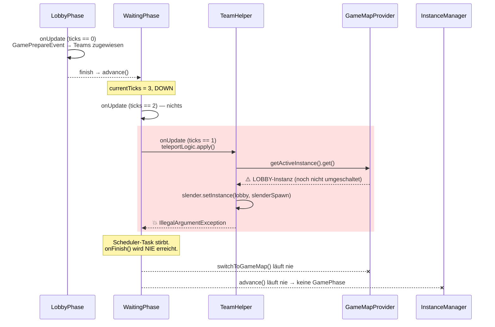

# Fix-Guide: Instanz-Wechsel Lobby → Game-Map

> **Scope:** Der Übergang von der Lobby-Instanz in die Game-Map-Instanz am Ende der
> `WaitingPhase` — `WaitingPhase`, `Cygnus#initPhases`, `GameMapProvider#switchToGameMap`,
> `TeamHelper#teleportTeams`, `TeleportStrategy`.
> Der Chunk-Sichtbarkeits-Workaround (`InstanceSwitchChunkPlayer`) ist **nicht** die Ursache —
> er greift korrekt, kommt aber gar nicht erst zum Zug. Siehe [Nicht die Ursache](#nicht-die-ursache).

## Wie du dieses Dokument benutzt

Jeder Fix hat eine **Sprungmarke**. In IntelliJ:

| Was | Shortcut | Eingabe |
|---|---|---|
| Klasse öffnen | `Ctrl+N` (`Cmd+O`) | `WaitingPhase` |
| Datei öffnen | `Ctrl+Shift+N` | `WaitingPhase.java` |
| Zu Zeile springen | `Ctrl+G` (`Cmd+L`) | `48` |
| Alle Aufrufer finden | `Alt+F7` auf dem Symbol | — |
| Zurück zum Ausgangspunkt | `Ctrl+Alt+←` | — |

Die Reproduktion liegt bereits im Repo:
`game/src/test/java/net/onelitefeather/cygnus/map/GameMapSwitchOrderIntegrationTest.java`.
Sie ist **heute grün**, weil sie das *kaputte* Verhalten festschreibt. Nach den Fixes muss sie
umgedreht werden — siehe [Tests](#tests).

---

## 1. Das Gesamtbild

Der Wechsel besteht aus **drei** Schritten, die zwingend in dieser Reihenfolge laufen müssen:

1. Provider auf die Game-Map umschalten (`activeInstance = gameInstance`)
2. Spieler in die neue Instanz bewegen (`setInstance`)
3. Alte Lobby-Instanz abbauen (`unregisterInstance`)

Der Code führt sie in der Reihenfolge **2 → 3 → 1** aus. Schritt 1 und 3 stecken zusammen in
`GameMapProvider#switchToGameMap`, und der wird eine Sekunde *nach* dem Teleport gefeuert.



**Ergebnis auf dem Server:** Der Countdown läuft auf 0, dann passiert nichts mehr. Keine GamePhase,
kein `GameStartEvent`, kein Slender-Item, keine Pages. Die Spieler stehen in der Lobby, bis der
Prozess neu gestartet wird.

---

## 2. Die Fehlerkette im Detail

### 2.1 Der Auslöser: `getActiveInstance()` ist ein Live-Supplier

`AbstractMapProvider#getActiveInstance()` (Aves 1.16.1) gibt `() -> this.activeInstance` zurück —
also **kein Snapshot**, sondern ein Blick auf das Feld zum Aufrufzeitpunkt. Der Aufruf in
`Cygnus#initPhases` (Zeile 189) fragt es genau in dem Moment ab, in dem es noch die Lobby ist.

```java
// Cygnus.java:187-198
VoidConsumer instanceSwitch = gameMapProvider::switchToGameMap;   // → onFinish, ticks == 0
VoidConsumer teamInitializer = () -> {
    Instance activeInstance = gameMapProvider.getActiveInstance().get();   // ⚠️ noch die Lobby
    ...
    TeamHelper.teleportTeams(this.teamService, gameMapProvider.getGameMap(), activeInstance);
};
```

Und in `WaitingPhase` läuft `teleportLogic` **vor** `instanceSwitch`:

```java
// WaitingPhase.java:42-52
@Override
protected void onFinish() {          // ticks == 0
    this.instanceSwitch.apply();     // ← Schritt 1 + 3
    this.gameView.addPlayers(...);
}

@Override
public void onUpdate() {
    if (getCurrentTicks() == 1) {    // ← eine Sekunde FRÜHER
        this.teleportLogic.apply();  // ← Schritt 2
    }
}
```

`TimedPhase#onUpdate0` zählt herunter und ruft `finish()` erst im *nächsten* Durchlauf, nachdem
`currentTicks` bereits 0 ist. Zwischen `teleportLogic` und `instanceSwitch` liegen damit **zwei
Sekunden**.

### 2.2 Der harte Abbruch: der Slender

`TeamHelper#teleportTeams` behandelt Slender und Survivor unterschiedlich:

```java
// TeamHelper.java:165 — ohne Guard
slenderTeam.getPlayers().forEach(player -> updateInstance(player, gameInstance, gameMap.getSlenderSpawn()));

// TeamHelper.java:241
private static void updateInstance(Player player, Instance instance, Pos position) {
    player.setInstance(instance, position);
}
```

Minestom lehnt das ab, weil Ziel- und Ist-Instanz identisch sind:

```java
// net.minestom.server.entity.Player:620-622 (Minestom 2026.07.22-26.2)
public CompletableFuture<Void> setInstance(Instance instance, Pos spawnPosition) {
    final Instance currentInstance = this.instance;
    Check.argCondition(currentInstance == instance, "Instance should be different than the current one");
```

→ `IllegalArgumentException: Instance should be different than the current one`

Die Exception fliegt in einem Minestom-Scheduler-Task. `SchedulerImpl` (Zeile 103-106) fängt sie und
antwortet mit `TaskSchedule.stop()`:

```java
} catch (Throwable t) {
    MinecraftServer.getExceptionManager().handleException(new RuntimeException("Exception in scheduled task", t));
    schedule = TaskSchedule.stop();
}
```

Der Repeat-Task der `WaitingPhase` wird also **abgeschaltet**, nicht bloß übersprungen. `onFinish()`
und damit `super.finish()` → `finishedCallback` → `LinearPhaseSeries#advance()` laufen nie. Die
Phasenkette steht.

### 2.3 Der stille Fehler: die Survivor

`TeleportStrategy` hat den Guard, der `updateInstance` fehlt:

```java
// TeleportStrategy.java:33-37 (ROUND_ROBIN_RANDOM), 51-55 (SINGLE)
if (player.getInstance() != null && player.getInstance().equals(instance)) {
    player.teleport(spawnPos);      // ← greift hier, weil instance == Lobby
} else {
    player.setInstance(instance, spawnPos);
}
```

Die Survivor werfen deshalb *nicht*, sondern werden auf die **Arena-Koordinaten innerhalb der
Lobby-Welt** teleportiert. Je nach Lobby-Map ist das Void, eine Wand oder ein zufälliger Punkt.
Dieser Zweig ist der Grund, warum das Symptom manchmal als „Spieler fallen ins Nichts" statt als
„nichts passiert" berichtet wird — es hängt davon ab, ob der Slender-Teleport zuerst dran ist.

### 2.4 Die zweite Sperre: die Lobby lässt sich nicht abbauen

Selbst wenn 2.2 wegfällt (etwa weil der Slender-Guard nachgerüstet wird), schlägt der nächste
Schritt fehl:

```java
// GameMapProvider.java:56-64
public void switchToGameMap() {
    if (this.activeInstance != null) {
        MinecraftServer.getInstanceManager().unregisterInstance(this.activeInstance);   // 💥
        ...
```

```java
// net.minestom.server.instance.InstanceManager:113-115
public void unregisterInstance(Instance instance) {
    long onlinePlayers = instance.getPlayers().stream().filter(Player::isOnline).count();
    Check.stateCondition(onlinePlayers > 0, "You cannot unregister an instance with players inside.");
```

→ `IllegalStateException: You cannot unregister an instance with players inside.`

Und weil der Check **vor** `this.activeInstance = null` steht, bleibt der Provider danach auf der
Lobby stehen. Alles, was später `getActiveInstance()` fragt (`PlayerLoginListener`,
`teleportToSpawn`), bekommt weiterhin die Lobby.

---

## 3. Die Fixes

Drei Änderungen, die zusammen die Reihenfolge **1 → 2 → 3** herstellen.

### Fix 1 — `switchToGameMap` in Umschalten und Abbauen trennen

**Sprungmarke:** `GameMapProvider.java:56`

Das Umschalten der Referenz und das Abbauen der alten Instanz sind zwei Ereignisse mit dem Teleport
dazwischen. Sie dürfen nicht in einer Methode stecken.

```java
/**
 * Switches the provider over to the game map.
 *
 * <p>This only moves the active references; the lobby instance stays registered so the players
 * can still be moved out of it. Call {@link #releasePreviousInstance()} once they are gone.</p>
 *
 * @throws IllegalStateException if the game map has not been loaded yet
 */
public void switchToGameMap() {
    if (this.gameInstance == null || this.gameMap == null) {
        throw new IllegalStateException("The game map has not been loaded yet");
    }
    this.previousInstance = this.activeInstance;
    this.activeInstance = this.gameInstance;
    this.activeMap = this.gameMap;
}

/**
 * Unregisters the instance the provider was on before the last switch.
 *
 * <p>Minestom refuses to unregister an instance that still holds online players, so this must
 * run after every player has been moved into the new instance. Calling it more than once, or
 * without a previous switch, does nothing.</p>
 */
public void releasePreviousInstance() {
    if (this.previousInstance == null) return;
    MinecraftServer.getInstanceManager().unregisterInstance(this.previousInstance);
    this.previousInstance = null;
}
```

Dazu das Feld neben `gameInstance`:

```java
private @Nullable InstanceContainer previousInstance;
```

> **Warum kein `null`-Check statt `throw`:** Wenn `loadGameMap()` nie lief, ist `gameInstance` null.
> Das jetzige `switchToGameMap` würde `activeInstance` dann auf `null` setzen und jeden späteren
> `getActiveInstance()`-Aufruf vergiften. Lauter Fehlschlag ist hier besser als stille Korruption.

### Fix 2 — Reihenfolge in `WaitingPhase` korrigieren

**Sprungmarke:** `WaitingPhase.java:42`

`onUpdate` bleibt der Ort für den Teleport, aber der Instanz-Wechsel muss davor liegen — und der
Abbau der Lobby danach.

```java
@Override
public void onStart() {
    super.onStart();
    EventDispatcher.call(new GamePreLaunchEvent());
    this.instanceSwitch.apply();     // Schritt 1: Provider zeigt ab jetzt auf die Game-Map
}

@Override
protected void onFinish() {
    this.gameView.addPlayers(new HashSet<>(MinecraftServer.getConnectionManager().getOnlinePlayers()));
}

@Override
public void onUpdate() {
    if (getCurrentTicks() == 1) {
        this.teleportLogic.apply();  // Schritt 2 + 3
    }
}
```

Das Umschalten in `onStart()` zu legen hat einen zweiten Vorteil: Zwischen Umschalten und Teleport
liegen jetzt zwei Sekunden, in denen die Game-Instanz bereits registriert und ihr Chunk-Loader
aktiv ist.

### Fix 3 — Lobby nach dem Teleport freigeben

**Sprungmarke:** `Cygnus.java:185` (`initPhases`)

Der `teamInitializer` ist die einzige Stelle, die weiß, wann alle Spieler umgezogen sind.

```java
private void initPhases() {
    GameMapProvider gameMapProvider = ((GameMapProvider) this.mapProvider);
    VoidConsumer instanceSwitch = gameMapProvider::switchToGameMap;
    VoidConsumer teamInitializer = () -> {
        Instance activeInstance = gameMapProvider.getActiveInstance().get();
        if (activeInstance == null) {
            throw new IllegalStateException("Active instance not available for team teleport");
        }
        TeamHelper.teleportTeams(
                this.teamService,
                gameMapProvider.getGameMap(),
                activeInstance
        );
        gameMapProvider.releasePreviousInstance();   // Schritt 3
    };
    ...
}
```

> **Achtung, asynchron:** `setInstance` liefert ein `CompletableFuture`, das erst fertig ist, wenn
> die Ziel-Chunks geladen sind. `teleportTeams` ignoriert die Futures heute. Solange
> `releasePreviousInstance()` direkt danach läuft, kann ein Spieler theoretisch noch als „in der
> Lobby" zählen. Sauber wäre, dass `teleportTeams` die Futures sammelt und
> `releasePreviousInstance()` an `CompletableFuture.allOf(...).thenRun(...)` hängt — siehe
> [Offene Punkte](#offene-punkte).

### Fix 4 — Guard für den Slender-Teleport

**Sprungmarke:** `TeamHelper.java:241`

Auch mit korrekter Reihenfolge bleibt `updateInstance` eine Falle: jeder künftige Aufruf mit der
aktuellen Instanz des Spielers wirft. Der Guard, den `TeleportStrategy` schon hat, gehört hierher.

```java
/**
 * Moves the player into the given instance, or teleports within it if the player is already there.
 *
 * @param player   the player to update
 * @param instance the new instance
 * @param position the new position
 */
private static void updateInstance(Player player, Instance instance, Pos position) {
    if (instance.equals(player.getInstance())) {
        player.teleport(position);
        return;
    }
    player.setInstance(instance, position);
}
```

> Alternativ ließe sich der Guard einmalig in `TeleportStrategy` zentralisieren und von beiden
> Pfaden nutzen. Das ist die schönere Variante, aber ein größerer Eingriff — für den Fix reicht
> die Symmetrie oben.

---

## 4. Tests

Die Reproduktion liegt in
`game/src/test/java/net/onelitefeather/cygnus/map/GameMapSwitchOrderIntegrationTest.java` und ist
**vor** den Fixes grün (🔴 = fängt den Bug):

| Test | Was er heute festschreibt |
|---|---|
| `testSlenderTeleportIntoTheLobbyThrows` 🔴 | `teleportTeams` mit der noch-Lobby wirft `IllegalArgumentException` |
| `testSurvivorsNeverLeaveTheLobby` 🔴 | Survivor landen auf Arena-Koordinaten *in der Lobby-Instanz* |
| `testSwitchWithPlayersInsideTheLobbyThrows` 🔴 | `switchToGameMap()` wirft, solange Spieler in der Lobby stehen |

**Nach den Fixes umdrehen.** Aus dem ersten Test wird:

```java
@Test
void testTeleportAfterSwitchMovesEveryoneIntoTheGameInstance(Env env, @TempDir Path root) throws IOException {
    GameMapProvider provider = createProvider(root);
    InstanceContainer lobbyInstance = (InstanceContainer) provider.getActiveInstance().get();
    provider.loadGameMap();

    Player slender = env.createPlayer(lobbyInstance, LOBBY_SPAWN);
    Player survivor = env.createPlayer(lobbyInstance, LOBBY_SPAWN);
    TeamService teamService = createTeamService();
    teamService.getTeam(GameConfig.SLENDER_KEY).orElseThrow().addPlayer(slender);
    teamService.getTeam(GameConfig.SURVIVOR_KEY).orElseThrow().addPlayer(survivor);

    provider.switchToGameMap();                                   // Schritt 1
    InstanceContainer gameInstance = (InstanceContainer) provider.getActiveInstance().get();
    assertNotSame(lobbyInstance, gameInstance);

    TeamHelper.teleportTeams(teamService, provider.getGameMap(), gameInstance);   // Schritt 2
    assertSame(gameInstance, slender.getInstance());
    assertSame(gameInstance, survivor.getInstance());
    assertEquals(SLENDER_SPAWN, slender.getPosition());

    assertDoesNotThrow(provider::releasePreviousInstance);        // Schritt 3
    assertFalse(MinecraftServer.getInstanceManager().getInstances().contains(lobbyInstance));

    provider.close();
    env.destroyInstance(gameInstance, true);
}
```

Ergänzend absichern (🛡️):

| Test | Zweck |
|---|---|
| `testSwitchWithoutLoadedGameMapThrows` 🛡️ | `switchToGameMap()` ohne `loadGameMap()` wirft, statt `activeInstance` auf `null` zu setzen |
| `testReleaseIsRepeatable` 🛡️ | `releasePreviousInstance()` zweimal hintereinander tut beim zweiten Mal nichts |
| `testUpdateInstanceWithinSameInstanceTeleports` 🛡️ | `teleportTeams` auf die bereits aktive Instanz wirft nicht mehr (Fix 4) |

Ausführen:

```bash
./gradlew :game:test --tests "net.onelitefeather.cygnus.map.GameMapSwitchOrderIntegrationTest"
./gradlew :game:test --tests "net.onelitefeather.cygnus.map.GameMapProviderIntegrationTest"
```

`GameMapProviderIntegrationTest#testGameInstanceUsesOwnFalcoChunkLoader` ruft `switchToGameMap()`
ohne Spieler auf und bleibt von den Fixes unberührt — er ist die Absicherung, dass der reine
Referenz-Wechsel weiter funktioniert.

---

## 5. Nicht die Ursache

### `InstanceSwitchChunkPlayer`

Der Workaround für [MC-310041](https://bugs.mojang.com/browse/MC/issues/MC-310041) (Chunks bleiben
nach einem Instanz-Wechsel unsichtbar) arbeitet korrekt — `InstanceSwitchChunkPlayerIntegrationTest`
ist grün. Er kommt beim Lobby→Game-Wechsel derzeit nur gar nicht zum Einsatz, weil der Wechsel
vorher abbricht. **Nach** den Fixes wird er zum ersten Mal wirklich benutzt; wenn dann schwarze
Chunks auftauchen, ist *das* der Ort zum Nachschauen, nicht vorher.

### Die Chunk-Loader

`FalcoAnvilLoader` hält Region-Dateien offen und wird erst im Shutdown-Task geschlossen
(`Cygnus.java:113`). `releasePreviousInstance()` schließt den Lobby-Loader **nicht** — das ist
gewollt, `GameMapProvider#close()` räumt beide zusammen ab. Kein Handlungsbedarf, aber gut zu
wissen, dass die Lobby-Region-Dateien bis zum Serverende geöffnet bleiben.

---

## 6. Weitere Befunde am Rand

Beim Nachvollziehen der Phasenkette aufgefallen, **nicht** Teil dieses Fixes:

### `GamePhase`s `finishedCallback` wird überschrieben

`Cygnus.java:202` übergibt `this::finishGame` an den `GamePhase`-Konstruktor, der es via
`setFinishedCallback` speichert. `LinearPhaseSeries#startCurrentPhase` überschreibt es unmittelbar
danach:

```java
// LinearPhaseSeries.java:115-118 (Xerus 1.12.1)
public void startCurrentPhase() {
    currentPhase.setFinishedCallback(this::advance);   // ← überschreibt finishGame
    currentPhase.start();
}
```

Folge: `Cygnus#finishGame()` läuft nie. Damit bleiben `pageProvider.cleanUp()`,
`staminaService.cleanUp()`, `ambientProvider.stopTask()`, `jumpscareManager.cleanUp()` und das
Zurücksetzen des `ClientEntityActionPacket`-Listeners aus. Bei einem Single-Match-Server, der
danach ohnehin per `RestartPhase` stoppt, fällt das nicht auf — es wird relevant, sobald der Server
mehrere Runden spielen soll. Der übliche Weg wäre, das Cleanup an `GameFinishEvent` zu hängen statt
an den Callback.

### `LobbyPhase#onUpdate` hängt am exakten Tick-Wert

`GameMapLoadEvent` wird nur bei exakt `getCurrentTicks() == FORCE_START_TIME - 1` (also 10)
gefeuert. Wird dieser Wert je übersprungen, bleibt `gameInstance` `null` und der Wechsel hat kein
Ziel. Aktuell ist das abgesichert: `GameConfigBuilder#lobbyTime` wirft bei
`lobbyTime <= FORCE_START_TIME`, der Default ist 30, `GameConfigReader` geht über den Builder, und
`setForceStarted(true)` setzt auf exakt 11 — der Countdown läuft also immer durch die 10. Trotzdem
ist die Kopplung „Feature funktioniert, solange niemand die Konstante anfasst" fragil; ein
`if (getCurrentTicks() <= FORCE_START_TIME - 1)` mit dem idempotenten `loadGameMap()` dahinter wäre
robuster. Mit Fix 1 fällt ein verpasster Load immerhin laut auf, statt `activeInstance` still auf
`null` zu setzen.

---

## Offene Punkte

- **Futures von `teleportTeams`:** Die Methode ignoriert die `CompletableFuture`s von
  `setInstance`. Für `releasePreviousInstance()` wäre `CompletableFuture.allOf(...)` die korrekte
  Bedingung. Solange alle Ziel-Chunks bereits geladen sind, gibt Minestom
  `AsyncUtils.VOID_FUTURE` (bereits fertig) zurück und das Problem tritt nicht auf — verlassen
  sollte man sich darauf nicht.
- **Spieler, die während der `WaitingPhase` verbinden:** `PlayerLoginListener` kickt alles, was
  nicht in der `LobbyPhase` ist, also greift der Fall nicht. Sollte das gelockert werden, braucht
  `releasePreviousInstance()` einen erneuten Leer-Check.
- **Zentraler Instanz-Wechsel-Helfer:** `TeleportStrategy` (2×), `TeamHelper#updateInstance` und
  `AbstractMapProvider#teleportToSpawn` implementieren dieselbe „bin ich schon da?"-Logik jeweils
  eigenständig — bzw. eben nicht. Ein gemeinsamer Helfer in `common` würde Fix 4 überflüssig machen.
