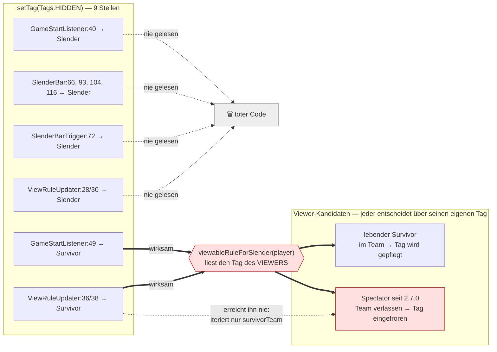
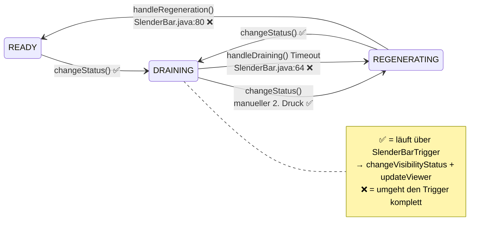
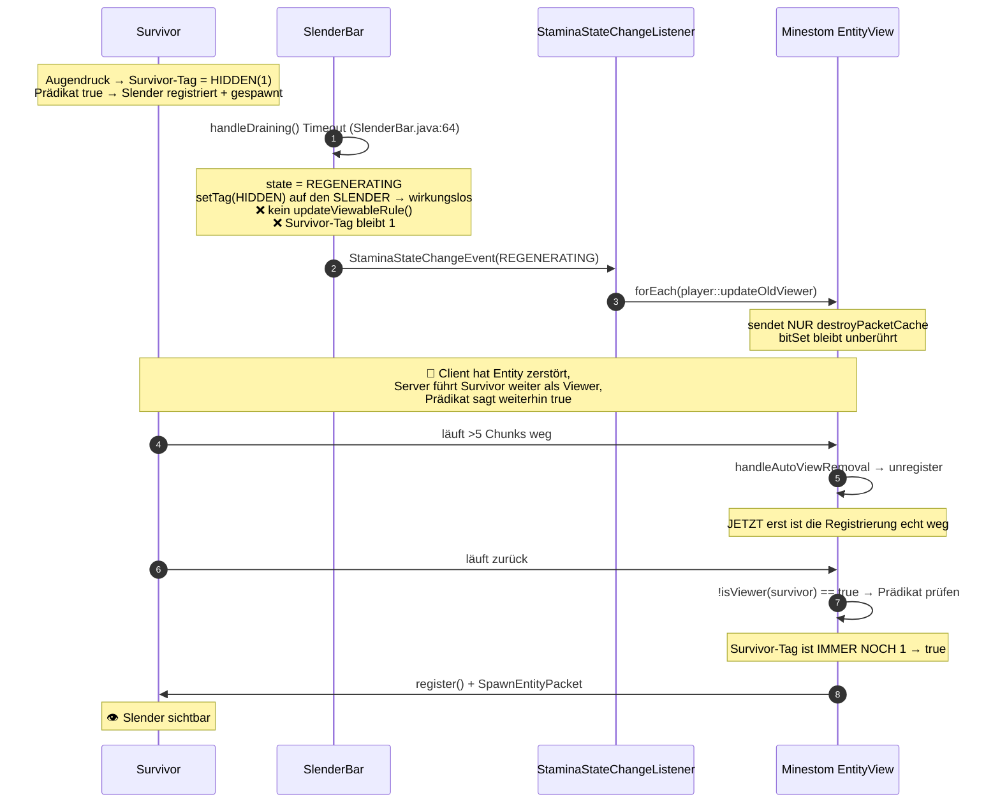
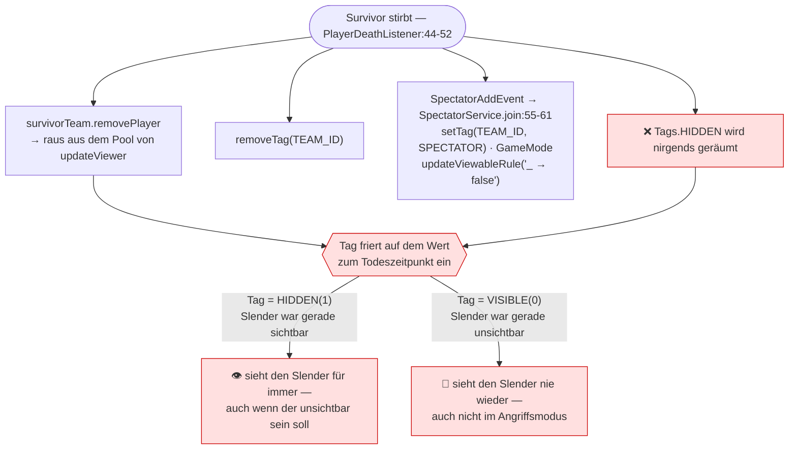
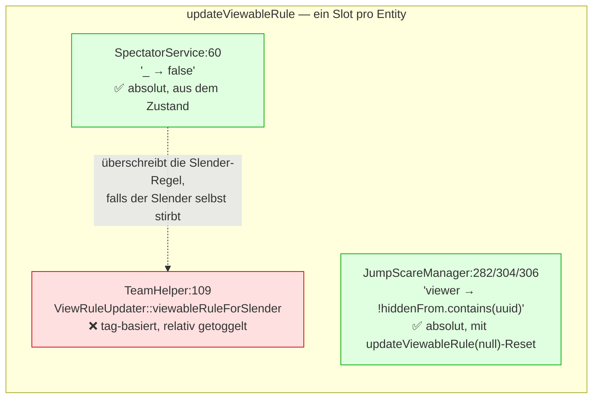

# Fix-Guide: Slender-Sichtbarkeit

> **Symptom:** Man läuft aus der View-Distance und wieder hinein — und sieht den Slender, obwohl er
> unsichtbar sein sollte.
>
> **Kurzdiagnose:** Kein Regressions-Commit. Der Sichtbarkeitspfad ist seit dem Initial-Commit
> `c65313e` falsch verdrahtet und nur kosmetisch verändert worden. Was sich wie eine wiederkehrende
> Regression anfühlt, ist ein latenter Konstruktionsfehler, der bei jeder Änderung an Bewegung,
> Chunk-Handling oder Instanzwechsel anders zutage tritt.
>
> **Stand 06.08.2026:** Alle sechs Befunde sind unverändert offen und durch
> `SlenderVisibilityIntegrationTest` reproduziert. Das Spectator-System (`d29578b`, seit 2.7.0) hat
> einen **siebten** Sichtbarkeits-Leak hinzugefügt — siehe [Abschnitt 2b](#2b-das-spectator-system-seit-270).

## Wie du dieses Dokument benutzt

Navigation wie im [Sprint-Guide](sprint-stamina-fix-guide.md): `Ctrl+N` für Klassen, `Ctrl+G` für
Zeilen, `Alt+F7` für Aufrufer. Alle Zeilenangaben sind gegen den aktuellen `main`-Stand geprüft, alle
Minestom-Zitate gegen `minestom-2026.07.12-26.2-sources.jar`.

**Lies zuerst [Abschnitt 1](#1-das-kernmissverständnis).** Ohne diesen einen Punkt wirkt der
restliche Code zufällig — und genau deshalb waren die bisherigen Fixversuche wirkungslos.

---

## 1. Das Kernmissverständnis

Minestom übergibt dem `viewableRule`-Prädikat **den Kandidaten-Viewer**, nicht die Entity, der die
Regel gehört. Verifiziert in `EntityView.java:68-77`:

```java
if (!entity.isViewer(player) &&
        player.getVehicle() != entity &&
        entity.viewEngine.viewableOption.predicate(player) &&   // ← player, nicht entity
        player.viewEngine.viewerOption.predicate(entity)) {

    entity.viewEngine.viewableOption.register(player);
    ...
}
```

Die einzige jemals installierte Regel ist `TeamHelper.java:107-111`:

```java
private static void assignSlender(Player player, Team slenderTeam) {
    player.setTag(Tags.TEAM_ID, SLENDER_TEAM_ID);
    player.updateViewableRule(ViewRuleUpdater::viewableRuleForSlender);
    slenderTeam.addPlayer(player);
}
```

Das Prädikat bekommt also **den Survivor** übergeben und liest `Tags.HIDDEN` **des Survivors**:

```java
// ViewRuleUpdater.java:42-44
public static boolean viewableRuleForSlender(Player player) {
    return player.hasTag(Tags.HIDDEN) && player.getTag(Tags.HIDDEN) == SlenderBarHelper.HIDDEN;
}
```

**Konsequenz:** Von 9 Schreibstellen auf `Tags.HIDDEN` zielen nur 2 auf einen Survivor. Die anderen
7 schreiben auf den Slender und werden **von niemandem gelesen**.



**Das erklärt, warum jeder bisherige Fix an `SlenderBar.changeStatus()` folgenlos blieb** — z. B.
Commit `2233076 "Fix showing of slender after full drain"`. Er ändert einen Tag, den die Regel nie
ansieht.

Zwei weitere Stolperfallen im selben File:

- `isViewAble` (`:11-13`) und `isHidden` (`:42-44`) sind **Zeile für Zeile identisch**,
  tragen aber gegensätzliche Bedeutungen („ist versteckt" vs. „darf sehen").
- Die Namen sind **vertauscht**: `showSlender` wird auf **Survivors** angewandt (`:20`),
  `showSurvivor` auf den **Slender** (`:21`).

---

## 2. Warum dein Symptom auftritt

Es gibt **vier Ausgänge** aus dem DRAINING-Zustand, aber nur **einer** räumt die Sichtbarkeit auf:



Der Timeout-Pfad ist der **Normalfall**: man drückt das Auge einmal und lässt die 16 Sekunden
auslaufen. Genau dieser Pfad räumt nicht auf.



**Warum ausgerechnet die View-Distance?** Solange du in Reichweite bleibst, blockiert
`!entity.isViewer(player)` (`EntityView.java:71`) den Respawn — der Server hält dich ja noch für
einen Viewer. Erst das echte Austragen beim Chunk-Austritt macht den Weg für den falschen
Wiedereinstieg frei. Die Reichweite ist `ServerFlag.java:18`
`ENTITY_VIEW_DISTANCE = 5` Chunks (80 Blöcke).

Der Zustand hält **bis zum nächsten Augendruck** und betrifft **alle Survivor gleichzeitig**, weil
`ViewRuleUpdater.java:20` das gesamte Team taggt, unabhängig von der Entfernung.

### Folgeschaden: die Polarität kippt dauerhaft

`showSurvivor` und `showSlender` sind beides **relative Toggles** (`:26-40`) — sie kippen den
Ist-Wert, statt den Soll-Wert aus dem Zustand abzuleiten. Nach dem übersprungenen Timeout stehen die
Survivor-Tags auf 1, also macht der nächste Augendruck sie auf 0 → **der Angriffsmodus versteckt den
Slender**, der Regenerationsmodus zeigt ihn. Ab da ist alles 180° verdreht.

Verschärfend: der vermeintliche Schutz in `SlenderBar.java:88`

```java
if (state == State.REGENERATING && this.time <= 10) return false;
```

kann nie greifen — `time` ist `private final int time` (`:28`), im Konstruktor auf `MAX_TIME = 16`
gesetzt (`:35`) und nie verändert. Gemeint war `currentTime`. `changeStatus()` liefert damit
**immer** `true`.

---

## 2b. Das Spectator-System (seit 2.7.0) {#2b-das-spectator-system-seit-270}

Commit `d29578b` hat einen **eigenständigen, zweiten Leak** hinzugefügt. Er ist unabhängig von Fix 2
— er trifft sogar den manuellen Doppeldruck, also genau den einen Pfad, der bis dahin korrekt
aufräumte.

Beim Tod verliert der Spieler das Survivor-Team und seine `TEAM_ID`, aber **nicht** `Tags.HIDDEN`.
Da das Prädikat den Tag des Viewers liest, entscheidet dieser eingefrorene Tag ab jetzt dauerhaft,
ob er den Slender sieht — und `ViewRuleUpdater.updateViewer` fasst ihn nie wieder an, weil es über
`survivor.getPlayers()` iteriert (`:20`, `:23`), das er gerade verlassen hat.



Beide Ausgänge sind Defekte: der eine verrät die Slender-Position an einen Toten, der andere macht
das Zuschauen sinnlos. Reproduziert in `SlenderSpectatorVisibilityIntegrationTest`.

### Drei Besitzer, ein Regel-Slot pro Entity

`updateViewableRule` hat pro Entity genau einen Slot — der letzte Aufruf **überschreibt** den
vorherigen. Inzwischen greifen drei Systeme darauf zu:



Zwei Dinge fallen daran auf:

- **`JumpScareManager` macht bereits genau das, was Fix 1 fordert** — eine absolute Regel, direkt aus
  dem Zustand abgeleitet, plus sauberer Reset über `updateViewableRule(null)` (`:304`). Das Muster
  muss also nicht erfunden, sondern nur auf den Slender übertragen werden.
- `PlayerDeathListener:52` feuert `SpectatorAddEvent` für **jeden** Toten, ohne Team-Prüfung. Stirbt
  der Slender, überschreibt `SpectatorService.join` seine Sichtbarkeitsregel mit `_ -> false`. Nach
  Fix 1 muss dieser Pfad die Slender-Regel entweder ausnehmen oder bewusst ersetzen.

---

## 3. Ausgangslage: es gibt bereits einen halben Fix

**Wichtig, bevor du anfängst:** Auf `origin/fix/visibility-system` (19.07.2026, theEvilReaper) liegt
ein ungemergter Branch, der die **Architektur bereits richtig löst**. Er:

- löscht `ViewRuleUpdater.java` **komplett**,
- führt `SlenderVisibilityChangeEvent(player, hidden)` ein,
- und leitet die Regel direkt aus dem Zustand ab statt aus einem Tag:

```java
// SlenderVisibilityChangeListener.java (auf dem Branch)
public void accept(SlenderVisibilityChangeEvent event) {
    Player slender = event.getPlayer();
    boolean hidden = event.isHidden();
    slender.updateViewableRule(viewer -> !hidden);
}
```

Das ist genau der richtige Ansatz: **absolut, aus dem Zustand, ohne Tag-Umweg.** Gefeuert wird es an
drei Stellen — `SlenderBarTrigger` (manueller Druck), `TeamHelper.assignSlender` (Rundenstart) und
`SlenderReviveListener` (Rollenwechsel). Ein Test ist dabei.

**Aber er behebt dein Symptom nicht.** `SlenderBar.java` ist **nicht** unter den 9 geänderten
Dateien — der Auto-Timeout-Pfad feuert das neue Event also nicht, und `changeVisibilityStatus`
toggelt weiterhin relativ. Auch `StaminaStateChangeListener` bleibt unangetastet.

### Empfehlung

| Weg | Vorgehen |
|---|---|
| **A (empfohlen)** | Branch mergen/rebasen, dann Fix 2, 3, 5 und 7 aus diesem Guide ergänzen |
| **B** | In `main` von Hand, Fix 1–7 der Reihe nach — nutze den Branch als Vorlage für Fix 1 |

Der Guide ist so geschrieben, dass beide Wege funktionieren.

> **Stand 06.08.2026 zu Weg A:** Der Branch liegt inzwischen **48 Commits** hinter `main` und
> merged nicht mehr konfliktfrei. Betroffen sind `Cygnus.java` (Imports + Listener-Registrierung)
> und `GameStartListener.java`. Beides ist überschaubar, aber einplanen. Neu hinzugekommen ist
> außerdem das Spectator-System, das der Branch nicht kennt — Fix 7 ist in beiden Wegen nötig.

---

## 4. Die Fixes

| # | Ort | Was | Behebt |
|---|---|---|---|
| [1](#fix-1) | `ViewRuleUpdater` → Event | Regel aus dem Zustand statt aus Tags | Wurzel |
| [2](#fix-2) | `SlenderBar.java:64, 80` | Timeout an den zentralen Pfad anschließen | **dein Symptom** |
| [3](#fix-3) | `StaminaStateChangeListener` | rohe Paket-Sender entfernen | Client/Server-Divergenz |
| [4](#fix-4) | `SlenderReviveListener` | Rollenwechsel vollständig | neuer Slender dauerhaft sichtbar |
| [5](#fix-5) | `StaminaBar` / `StaminaService` | `onStop()` + Cleanup | Runde 2 |
| [6](#fix-6) | `SlenderBar.java:88` | `this.time` → `currentTime` | toter Guard |
| [7](#fix-7) | `PlayerDeathListener` / `SpectatorService` | Spectator aus dem Tag-Modell lösen | Spectator-Leak |

---

### Fix 1 — Sichtbarkeit aus dem Zustand ableiten, nicht aus einem Tag {#fix-1}

**Springe zu:** `ViewRuleUpdater.java` (ganze Datei), `TeamHelper.java:109`

#### Warum nicht einfach den Tag reparieren

Naheliegend wäre, `Tags.HIDDEN` konsequent auf den Survivors zu pflegen. Das ist der falsche Weg:
Ein gespiegelter Zustand muss bei **jedem** Übergang synchron gehalten werden — und genau dieses
Synchronhalten ist das, was hier seit dem Initial-Commit schiefgeht. Vier Übergänge, von denen zwei
den Sync überspringen, sind kein Sync-Problem, sondern ein Designproblem.

Der Ausweg: Das Prädikat wird bei **jedem** Viewer-Add ohnehin neu ausgewertet
(`EntityView.java:73`). Es kann den Zustand also direkt lesen. Dann gibt es nichts mehr zu
synchronisieren.

#### Der Fix

Übernimm das Muster vom Branch — Event plus Listener:

```java
// event/SlenderVisibilityChangeEvent.java
public record ... // Player + boolean hidden, wie auf dem Branch

// listener/game/SlenderVisibilityChangeListener.java
public void accept(SlenderVisibilityChangeEvent event) {
    event.getPlayer().updateViewableRule(viewer -> !event.isHidden());
}
```

Und lösche `ViewRuleUpdater` samt allen 7 toten `setTag(Tags.HIDDEN, …)`-Aufrufen auf dem Slender
(`GameStartListener:40`, `SlenderBar:66/93/104/116`, `SlenderBarTrigger:72`).

> **Warum `updateViewableRule(Predicate)` und nicht `removeViewer`?**
> `Entity.removeViewer(player)` (`Entity.java:536`) ist hier **untauglich**: es delegiert an
> `EntityView.manualRemove` (`:126-135`), das für Auto-Viewer `false` liefert und ein kompletter
> No-Op ist — der Spieler steht gar nicht in `manualViewers`. Nur `updateViewableRule(Predicate)`
> (`Entity.java:492`) und `setAutoViewable(false)` (`:488`) ändern `bitSet` **und** Pakete.

#### Gegenprobe
`grep -rn "Tags.HIDDEN" game/src/main/` → nach dem Fix keine Treffer mehr (oder nur noch dort, wo
der Tag eine andere, klar benannte Bedeutung hat).

---

### Fix 2 — Der Auto-Timeout muss durch denselben Pfad wie der manuelle Druck {#fix-2}

**Springe zu:** `SlenderBar.java:56-85`

**Das ist der Fix für dein gemeldetes Symptom.** Ohne ihn bleibt der Bug bestehen, auch mit Fix 1
und auch mit dem gemergten Branch.

#### Was aktuell dasteht

```java
private void handleDraining() {
    if (currentTime >= 0) {
        // ... drain
        return;
    }
    state = State.REGENERATING;
    colorState = StaminaColors.REGENERATING;
    player.setTag(Tags.HIDDEN, HIDDEN);                        // ← wirkungslos
    EventDispatcher.call(new StaminaStateChangeEvent(player, state));
    // ... Effekte, Speed, Sprint
}                                                              // ← kein Sichtbarkeits-Update
```

Zum Vergleich der **manuelle** Pfad, der es richtig macht — `SlenderBarTrigger.java:58-61`:

```java
if (slenderBar.changeStatus()) {
    this.changeVisibilityStatus(player);
    this.updateRuneFunction.accept(player);   // → ViewRuleUpdater.updateViewer
}
```

**Die Asymmetrie zwischen diesen beiden Ausgängen aus DRAINING ist der Defekt.** Dasselbe gilt für
`handleRegeneration()` (`:75-85`): der Übergang REGENERATING → READY in Zeile 80-83 aktualisiert
ebenfalls nichts.

#### Der Fix

Feuere aus **beiden** automatischen Übergängen dasselbe Sichtbarkeits-Event wie der manuelle Pfad:

```java
private void handleDraining() {
    if (currentTime >= 0) {
        // ... unverändert
        return;
    }
    state = State.REGENERATING;
    colorState = StaminaColors.REGENERATING;
    EventDispatcher.call(new StaminaStateChangeEvent(player, state));
    EventDispatcher.call(new SlenderVisibilityChangeEvent(player, true));   // ← unsichtbar
    // ... Effekte unverändert
}
```

Sauberer, falls du etwas mehr umbauen willst: **einen einzigen privaten Übergangspunkt** in
`SlenderBar` einführen, durch den *alle* State-Wechsel laufen —
`changeStatus()`, der Timeout und der READY-Übergang. Dann kann kein künftiger Pfad den
Sichtbarkeitsteil mehr vergessen. Das ist die strukturelle Variante von Fix 2 und der Grund, warum
dieser Bug wiederkommen wird, solange es vier getrennte Ausgänge gibt.

---

### Fix 3 — `updateNewViewer`/`updateOldViewer` sind keine Sichtbarkeits-API {#fix-3}

**Springe zu:** `StaminaStateChangeListener.java:25-38`, `GameStartListener.java:52-57`

#### Warum das falsch ist

Beide Methoden sind in Minestom `@ApiStatus.Internal` (`Entity.java:548` bzw. `:574`) und sind
**reine Paket-Sender**:

```java
// Entity.java:575-578
@ApiStatus.Internal
public void updateOldViewer(Player player) {
    leashedEntities.forEach(entity -> player.sendPacket(new AttachEntityPacket(entity.getEntityId(), -1)));
    player.sendPacket(destroyPacketCache);
}
```

Der autoritative Zustand liegt in `EntityView.Option.bitSet`, geändert **nur** durch
`register`/`unregister` (`EntityView.java:206-213`). Solange `isRegistered == true` gilt, fließen
weiterhin **alle** `sendPacketToViewers`-Pakete (Metadata, Equipment, Bewegung) an die Survivors —
`getViewers()` iteriert allein über den bitSet, das Prädikat gatet dort nichts.

Zusätzlich gehen diese Pakete an **alle** `getOnlinePlayers()`, während `updateViewableRule()` nur
5 Chunks weit reicht. Spieler außerhalb behalten eine eingefrorene Geist-Entity.

#### Der Fix

Beide Blöcke ersatzlos streichen. Nach Fix 1 + 2 erledigt das Sichtbarkeits-Event alles — es ändert
bitSet **und** verschickt die Pakete. Der `broadcastPlayPacket(getMetadataPacket())`-Teil kann
bleiben, wenn ihr die Metadaten wirklich broadcasten wollt; die `updateNewViewer`/`updateOldViewer`-
Schleifen müssen weg.

> **Nebenbefund `GameStartListener.java:52-57`:** In Runde 1 ist diese Schleife toter Code — Zeile 49
> setzt die Survivors auf `VISIBLE`, das Prädikat ist damit false, der Slender ist gar nicht
> registriert. Der echte Defekt dort ist das **fehlende Sichtbarkeits-Update nach Zeile 40**: der
> Rundenstart verlässt sich darauf, dass zufällig noch kein Survivor im bitSet steht.

---

### Fix 4 — `SlenderReviveListener` vollzieht den Rollenwechsel nicht {#fix-4}

**Springe zu:** `SlenderReviveListener.java:32-41`

```java
staminaService.setSlenderBar(player, true);
player.setTag(Tags.TEAM_ID, TeamHelper.SLENDER_TEAM_ID);
```

Kein `updateViewableRule(...)`, kein Sichtbarkeits-Event. Der **neue Slender hat gar keine Regel** →
`predicate == null` → `EntityView.java:197-200` liefert bedingungslos `true` → **dauerhaft für alle
sichtbar**.

Gleichzeitig behält der alte Slender seine Regel: `Entity.removeFromInstance` (`:936`) fasst
`Option.predicate` nicht an.

**Fix:** dieselbe Sequenz durchlaufen wie `TeamHelper.assignSlender` (`TeamHelper.java:107-111`) —
Regel installieren und Sichtbarkeits-Event feuern — **und** den alten Slender abräumen. Der Branch
aus Abschnitt 3 macht den ersten Teil bereits (`SlenderReviveListener.java:37`).

Der zugehörige Test `SlenderReviveIntegrationTest.java:49-51` prüft heute nur TEAM_ID, Position und
`assertNotNull(getSlenderBar())` — er zementiert den unvollständigen Rollenwechsel, statt ihn zu
fangen.

---

### Fix 5 — Kein Cleanup über Rundengrenzen {#fix-5}

**Springe zu:** `StaminaBar.java:57-62`, `StaminaService.java:82-94`

`StaminaBar.stop()` hat kein `onStop()`-Gegenstück zu `onStart()` (`SlenderBar.java:40-44`), und
`StaminaService.cleanUp()` löscht weder Tags noch die ViewableRule. Ein `removeTag(Tags.HIDDEN)`
existiert **projektweit nirgends** — das einzige `removeTag` ist `PlayerDeathListener.java:50` für
`TEAM_ID`.

Konsequenz: Ist in Runde 2 ein anderer Spieler Slender, während alte Tags noch stehen, registriert
die Regel sofort alle nahen Spieler — **der Slender ist sichtbar, noch bevor das Auge je gedrückt
wurde**.

**Fix:** `onStop()` als abstrakte Pflichtmethode in `StaminaBar` einführen, aus `stop()` aufrufen;
`SlenderBar.onStop()` setzt Regel (`updateViewableRule((Predicate<Player>) null)`), Effekte,
Speed-Basis und Sprint zurück. Das ist derselbe Fix wie B4 im
[Sprint-Guide](sprint-stamina-fix-guide.md) — einmal bauen, beide Bereiche profitieren.

---

### Fix 6 — Toter Guard in `changeStatus()` {#fix-6}

**Springe zu:** `SlenderBar.java:88`

```java
if (state == State.REGENERATING && this.time <= 10) return false;
```

`this.time` → `this.currentTime`, und die `10` als benannte Konstante (z. B.
`REACTIVATION_THRESHOLD`). Solange die Bedingung konstant false ist, liefert `changeStatus()` immer
`true` und der Slender kann den Angriffsmodus mit leerer Bar sofort neu aktivieren.

---

### Fix 7 — Der Spectator hängt weiter am Tag-Modell {#fix-7}

**Springe zu:** `PlayerDeathListener.java:44-52`, `SpectatorService.java:55-61`

Siehe [Abschnitt 2b](#2b-das-spectator-system-seit-270) für die Herleitung. Der Fix hängt davon ab,
ob Fix 1 schon steht:

**Nach Fix 1** löst sich der Leak weitgehend von selbst: Die Regel wird dann aus dem Slender-Zustand
abgeleitet und gilt für jeden Viewer gleich — ein Spectator hat keinen eigenen Tag mehr, der
einfrieren könnte. Zu tun bleibt:

- In `SlenderVisibilityChangeListener` festlegen, ob Spectators den Slender **immer** sehen sollen
  (üblich für Zuschauermodi) oder der Slender-Sichtbarkeit folgen. Das ist eine Design-, keine
  Bugfrage — entscheidet es bewusst:
  ```java
  slender.updateViewableRule(viewer -> !hidden || TeamHelper.isSpectatorTeam(viewer));
  ```
- `PlayerDeathListener:52` feuert `SpectatorAddEvent` ohne Team-Prüfung. Stirbt der Slender,
  überschreibt `SpectatorService.join:60` seine Regel mit `_ -> false`. Entweder den Slender dort
  ausnehmen oder den Rollenwechsel bewusst durchführen (dann greift auch Fix 4).

**Vor Fix 1** (falls ihr Fix 7 vorziehen wollt) reicht ein `player.removeTag(Tags.HIDDEN)` in
`PlayerDeathListener` **nicht** — dann fällt der Spectator auf „kein Tag" und sieht den Slender nie
mehr. Ihr müsstet den Tag stattdessen aktiv auf `HIDDEN` halten, was das Sync-Problem aus
[Fix 1](#fix-1) nur verschiebt. **Empfehlung: Fix 1 zuerst.**

---

## 5. Tests

Für den Sichtbarkeitspfad existierte **kein einziger Test**; `GameViewIntegrationTest` ist
`@Disabled("Investigate why this test is broken")`. Inzwischen liegen zwei Reproduktionsklassen im
Repo — sie sind **rot** und dokumentieren den Ist-Zustand:

| Klasse | Deckt ab |
|---|---|
| `SlenderVisibilityIntegrationTest` | Fix 2 (Auto-Timeout, Polarität, View-Distance-Zyklus) |
| `SlenderSpectatorVisibilityIntegrationTest` | Fix 7 (eingefrorener Spectator-Tag, beide Richtungen) |

### Die entscheidende Assertion

Der Grund, warum dieser Bug so lange überlebt hat: Man sieht ihn nicht an den Paketen, sondern nur
am **Serverzustand**. Deshalb ist die wichtigste Zeile in allen folgenden Tests:

```java
assertFalse(slender.isViewer(survivor));
```

Genau diese Assertion trennt die beiden auseinandergelaufenen Kanäle — Client hat destroy bekommen,
Server führt den Viewer weiter — und hätte Fix 2 und Fix 3 sofort aufgedeckt. Ein Test, der nur auf
`DestroyEntitiesPacket` prüft, wäre **grün** und hätte nichts gefangen.

> **⚠️ Falle: der Test muss den Trigger-Pfad mitspielen.** Ruft ein Test nur
> `slenderBar.changeStatus()` auf, überspringt er `SlenderBarTrigger.changeVisibilityStatus` **und**
> `ViewRuleUpdater.updateViewer`. Dann bekommt der Survivor nie den `HIDDEN`-Tag, der Slender wird
> nie sichtbar — und `assertFalse(slender.isViewer(survivor))` ist **vacuously true**. Der Test ist
> grün, ohne irgendetwas zu prüfen.
>
> Deshalb hat jede der Klassen unten eine **Vorbedingungs-Assertion**
> (`assertTrue(slender.isViewer(survivor))` nach dem Augendruck), die genau das absichert, und eine
> `pressEye`-Hilfsmethode, die den Produktionspfad nachbildet. Streicht die beiden nicht weg.

### Die beiden Testklassen

Beide liegen bereits im Repo und sind **rot** — sie sind der Nachweis, nicht der Vorschlag.
Statt sie hier in voller Länge abzudrucken, hier nur der Teil, auf den es ankommt: der
nachgebildete Produktionspfad.

`game/src/test/java/net/onelitefeather/cygnus/stamina/SlenderVisibilityIntegrationTest.java`

```java
/** Replays what GameStartListener does at round start. */
private void startRound(Player slender, Player survivor) {
    slender.setTag(Tags.HIDDEN, SlenderBarHelper.HIDDEN);
    survivor.setTag(Tags.HIDDEN, SlenderBarHelper.VISIBLE);
    slender.updateViewableRule(ViewRuleUpdater::viewableRuleForSlender);
}

/** Replays an eye press: SlenderBarTrigger.trigger + ViewRuleUpdater.updateViewer. */
private void pressEye(SlenderBar bar, Player slender, Player survivor) {
    if (!bar.changeStatus()) return;
    // SlenderBarTrigger.changeVisibilityStatus
    Byte value = slender.getTag(Tags.HIDDEN);
    byte current = value != null ? value : SlenderBarHelper.VISIBLE;
    slender.setTag(Tags.HIDDEN, current == SlenderBarHelper.VISIBLE
            ? SlenderBarHelper.HIDDEN : SlenderBarHelper.VISIBLE);
    // ViewRuleUpdater.updateViewer(slender, survivorTeam) fuer ein Ein-Survivor-Team
    survivor.updateViewableRule();
    ViewRuleUpdater.showSlender(survivor);
    ViewRuleUpdater.showSurvivor(slender);
    slender.updateViewableRule();
    survivor.updateViewableRule();
}
```

Darauf setzen vier Tests auf — Zustand nach dem jeweiligen Übergang, gemessen an
`slender.isViewer(survivor)`:

| Test | Erwartung | Heute |
|---|---|---|
| `testEyePressMakesSlenderVisible` | Vorbedingung: Augendruck macht sichtbar | ✅ grün |
| `testAutoTimeoutUnregistersViewer` | nach Timeout kein Viewer mehr | 🔴 `expected false, was true` |
| `testManualToggleStaysCorrect` | manueller Doppeldruck räumt auf | ✅ grün — der einzige korrekte Pfad |
| `testPolarityStableAcrossCycles` | Zyklus 2 macht wieder sichtbar | 🔴 `expected true, was false` |
| `testViewDistanceCycleDoesNotRespawn` | 0 `SpawnEntityPacket` beim Wiedereintritt | 🔴 `expected 0, was 1` |

`game/src/test/java/net/onelitefeather/cygnus/stamina/SlenderSpectatorVisibilityIntegrationTest.java`

Hier kommt eine `die()`-Hilfsmethode dazu, die `PlayerDeathListener` + `SpectatorService.join`
nachbildet — und deren Auffälligkeit gerade ist, was **nicht** darin steht:

```java
private void die(Player player, List<Player> survivorTeam) {
    survivorTeam.remove(player);                 // raus aus dem Pool von updateViewer
    player.removeTag(Tags.TEAM_ID);
    player.setGameMode(GameMode.SPECTATOR);
    player.setTag(Tags.TEAM_ID, TeamHelper.SPECTATOR_TEAM_ID);
    player.updateViewableRule(_ -> false);
    // kein removeTag(Tags.HIDDEN) - genau das ist Fix 7
}
```

| Test | Erwartung | Heute |
|---|---|---|
| `testDeathLeavesHiddenTagBehind` | dokumentiert den eingefrorenen Tag | ✅ grün (Ist-Zustand) |
| `testManualToggleDoesNotReachSpectator` | Spectator wird mit ausgetragen | 🔴 `expected false, was true` |
| `testSpectatorSeesSlenderDuringAttack` | Spectator sieht den Angriffsmodus | 🔴 `expected true, was false` |

Beide Spectator-Tests prüfen **vor** der eigentlichen Assertion einen lebenden Kontroll-Survivor.
Der ist grün — was beweist, dass der Leak am Spectator-Status hängt und nicht am allgemeinen
Sichtbarkeitsdefekt aus Fix 2.

### Weitere fehlende Fälle

Nach Priorität, wenn du die Abdeckung ausbauen willst:

1. **Rundenstart:** nach `GameStartEvent` muss `slender.getViewers()` leer sein — auch in einer
   zweiten Runde mit denselben Spielern (fängt Fix 5).
2. **`SlenderReviveEvent`:** nach dem Revive muss der neue Slender eine Regel haben und für
   Survivors unsichtbar sein (fängt Fix 4). Erweitere `SlenderReviveIntegrationTest.java:49`.
3. **Instanzwechsel:** `setInstance` darf die Regel nicht verlieren — relevant wegen
   `TeamHelper.teleportTeams` und `InstanceSwitchChunkPlayer`.
4. **Später hinzukommender Spieler:** wer mitten in der Runde joint, darf einen unsichtbaren Slender
   nicht sehen.
5. **Tod des Slenders:** `PlayerDeathListener:52` feuert `SpectatorAddEvent` ohne Team-Prüfung —
   `SpectatorService.join:60` würde die Slender-Regel mit `_ -> false` überschreiben (siehe
   [Fix 7](#fix-7)).

---

## 6. Verifikation

```bash
./gradlew :game:test --tests '*Visibility*' --tests '*Slender*'
```

Checkliste:

- [ ] `SlenderVisibilityIntegrationTest` grün, insbesondere `testAutoTimeoutUnregistersViewer`
- [ ] `SlenderSpectatorVisibilityIntegrationTest` grün (Fix 7)
- [ ] Die Vorbedingungs-Assertions sind noch da — sonst sind die Tests vacuously grün
- [ ] `SlenderReviveIntegrationTest` weiterhin grün
- [ ] `grep -rn "updateNewViewer\|updateOldViewer" game/src/main/` → keine Treffer mehr
- [ ] `grep -rn "Tags.HIDDEN" game/src/main/` → keine Treffer mehr (oder klar benannte Restnutzung)
- [ ] `Alt+F7` auf `SlenderVisibilityChangeEvent` → gefeuert aus **allen** State-Übergängen:
      `changeStatus()` ×3, Timeout, READY-Übergang, Rundenstart, Revive
- [ ] `grep -rn "updateViewableRule" game/src/main/` → jeder Treffer gehört zu genau einem der drei
      Besitzer aus [Abschnitt 2b](#2b-das-spectator-system-seit-270); keiner überschreibt einen anderen

Manuell im Spiel — das ist die Sequenz, die den Bug erzeugt hat:

1. Runde starten, als Slender das Auge **einmal** drücken → sichtbar
2. **Nicht** erneut drücken, die ~16 s auslaufen lassen → Slender verschwindet
3. Als Survivor **über 96 Blöcke** weglaufen und zurückkommen → Slender muss **unsichtbar bleiben**
4. Auge erneut drücken → Slender muss **sichtbar** werden (nicht umgekehrt — das prüft die Polarität)
5. Runde zu Ende spielen, neue Runde mit anderem Slender → zu Rundenbeginn unsichtbar

Und die Spectator-Sequenz für Fix 7 — beide Richtungen, sie schlagen unterschiedlich fehl:

6. Auge drücken (Slender **sichtbar**), dann einen Survivor töten → als Spectator zuschauen:
   der Slender darf nach dem Zurückschalten **nicht** weiter sichtbar bleiben
7. Umgekehrt: einen Survivor töten, während der Slender **unsichtbar** ist → als Spectator muss man
   den Slender beim nächsten Augendruck **sehen** können

---

## Zusammenhang mit dem Sprint-Guide

Vier Befunde teilen sich dieselben Zeilen mit dem [Sprint-Guide](sprint-stamina-fix-guide.md):

| Gemeinsame Wurzel | Sprint-Seite | Sichtbarkeits-Seite |
|---|---|---|
| `SlenderBar.java:64-72` umgeht den Trigger | Effekte/Speed ohne Trigger-Pfad | Fix 2 — **dein Hauptsymptom** |
| `Tags.HIDDEN` relativ getoggelt | — | Fix 1, Polaritätsumkehr |
| `StaminaBar.stop()` ohne `onStop()` | Effekte/Attribute überleben Cleanup | Fix 5 — Regel und Tags überleben |
| `SlenderReviveListener` unvollständig | keine saubere Bar-Übergabe | Fix 4 — neuer Slender sichtbar |

**Wenn du beide Guides abarbeitest, bau `onStop()` (Fix 5 hier / B4 dort) nur einmal** — es ist
dieselbe Methode. Gleiches gilt für den toten Guard in `SlenderBar.java:88`.
