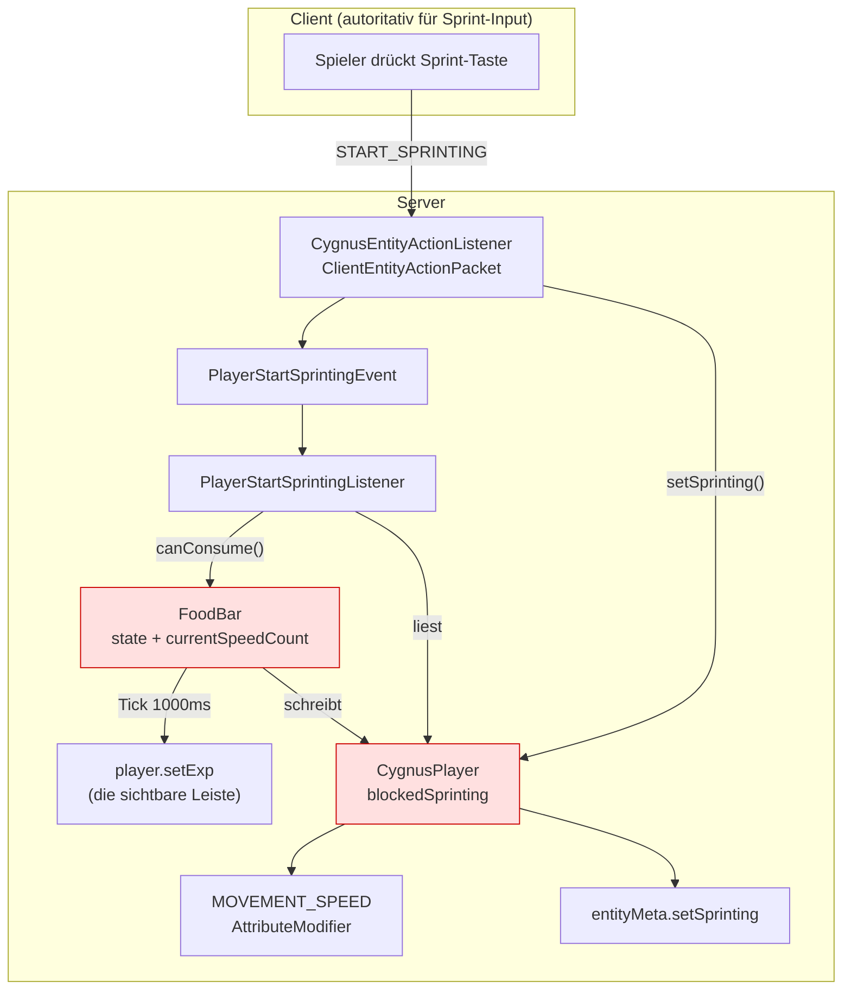
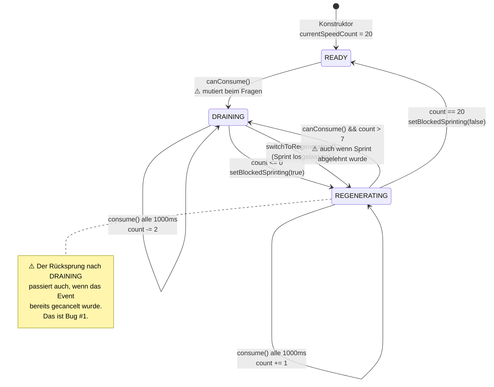
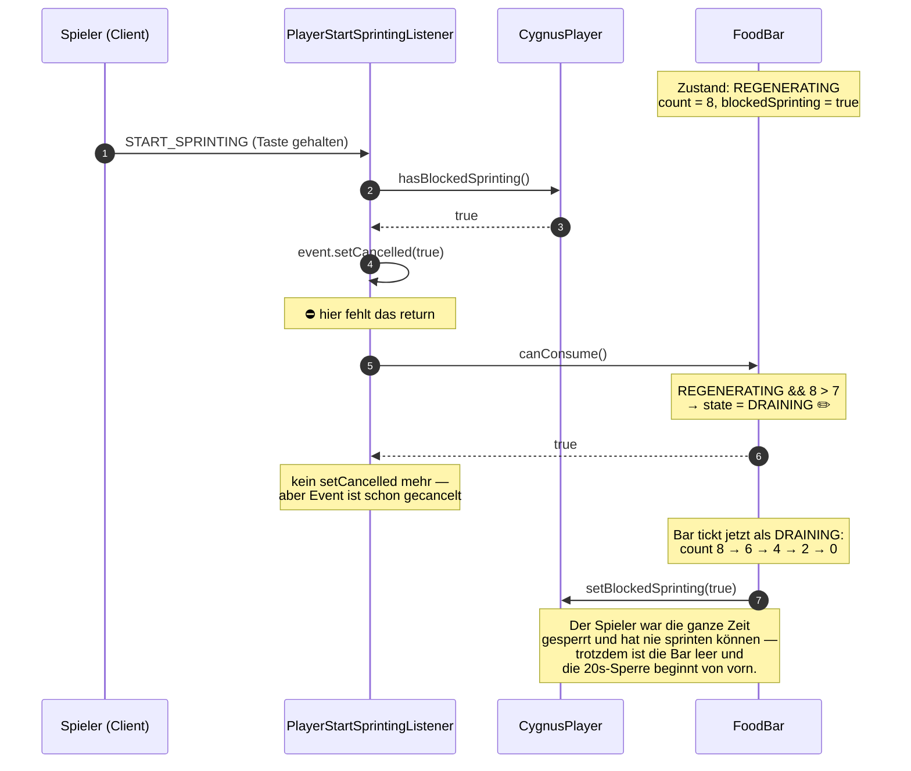

# Fix-Guide: FoodBar & Sprinten (Survivor-Seite)

> **Scope:** Nur der Survivor-Sprint-Pfad — `FoodBar`, `PlayerStartSprintingListener`,
> `CygnusPlayer.setSprinting`, `CygnusEntityActionListener`.
> Der Slender-Pfad (`SlenderBar`, `SlenderReviveListener`) hat eigene Befunde und ist
> **bewusst nicht** Teil dieses Guides — siehe Abschnitt [Bewusst ausgeklammert](#bewusst-ausgeklammert).

## Wie du dieses Dokument benutzt

Jeder Fix hat eine **Sprungmarke**. In IntelliJ:

| Was | Shortcut | Eingabe |
|---|---|---|
| Klasse öffnen | `Ctrl+N` (`Cmd+O`) | `FoodBar` |
| Datei öffnen | `Ctrl+Shift+N` | `FoodBar.java` |
| Zu Zeile springen | `Ctrl+G` (`Cmd+L`) | `78` |
| Alle Aufrufer finden | `Alt+F7` auf dem Symbol | — |
| Zurück zum Ausgangspunkt | `Ctrl+Alt+←` | — |

Empfohlener Ablauf pro Fix: **Test zuerst schreiben** (Abschnitt [Tests](#tests)) → Test läuft rot →
Fix anwenden → Test läuft grün. Die Tests sind so gebaut, dass sie den Bug *vorher* wirklich fangen;
bei jedem Test steht dabei, ob er vor dem Fix rot ist (🔴) oder reine Absicherung (🛡️).

---

## 1. Das Gesamtbild

Der Sprint-Zustand eines Survivors lebt an **vier** Orten gleichzeitig. Das ist die Wurzel fast aller
Symptome: niemand besitzt den Zustand, jeder schreibt darauf.



**Rot markiert = geteilter Zustand ohne Besitzer.** `blockedSprinting` wird von der `FoodBar`
geschrieben und vom Listener gelesen; `FoodBar.state` wird vom Listener geschrieben (über
`canConsume()`!) und von der Bar gelesen. Beide Richtungen — daher die Regressionen.

### Der Zustandsautomat der FoodBar

**Ist-Zustand** (`FoodBar.java`):



Die beiden ⚠️-Kanten sind das Problem: **`canConsume()` heißt wie eine Frage, ist aber ein
Zustandswechsel.** Der Aufrufer kann nicht folgenlos „nur mal nachsehen".

---

## 2. Der Hauptbug im Ablauf

Das ist die Sequenz hinter „die Stamina resettet nicht sauber" und „ich bin ewig gesperrt":



**Warum du das im Spiel als „kaputt" erlebst:** Du wartest auf Regeneration, hältst die Sprint-Taste
gedrückt (was jeder tut, wenn man wegrennen will), und die Bar fällt wieder auf null — ohne dass du
jemals schneller geworden bist. Gefühlt: „die Stamina resettet nicht" oder „ich bin dauerhaft gesperrt".

**Wichtige Einschränkung — damit du beim Testen nicht in die Irre läufst:** Kurzes *Antippen* der
Taste heilt sich selbst. Das folgende `STOP_SPRINTING`-Packet läuft über
`PlayerStopSprintingListener` → `switchToRegenerating()` und macht den Übergang rückgängig. Der
Schaden entsteht nur beim **gehaltenen** Sprint-Input. Es ist also kein harter Deadlock, sondern ein
reproduzierbarer Frust-Loop — deshalb ist der Bug bisher durch alle manuellen Tests gerutscht.

---

## 3. Die Fixes

Reihenfolge ist beabsichtigt: Fix 1 ist der eigentliche Bug, Fix 2–3 verhindern die nächste
Regression an derselben Stelle, Fix 4–5 sind Härtung.

| # | Ort | Was | Aufwand |
|---|---|---|---|
| [1](#fix-1) | `FoodBar` + `PlayerStartSprintingListener` | Query/Command trennen, `return` ergänzen | mittel |
| [2](#fix-2) | `FoodBar.handleFoodRegeneration` | Grenzwert + Clamping + Off-by-one | klein |
| [3](#fix-3) | `CygnusPlayer.setSprinting` | Attribut-Key-Kollision, Modifier im gesperrten Zweig | mittel |
| [4](#fix-4) | `StaminaService.getFoodBar` | Null-Sicherheit | klein |
| [5](#fix-5) | `CygnusEntityActionListener` | Entprellung | klein |

---

### Fix 1 — `canConsume()` ist ein Mutator und läuft nach dem Cancel weiter {#fix-1}

**Springe zu:** `PlayerStartSprintingListener.java:29-36` und `FoodBar.java:78-89`

#### Was aktuell dasteht

`PlayerStartSprintingListener.java:29`
```java
if (cygnusPlayer.hasBlockedSprinting()) {
    event.setCancelled(true);
}

FoodBar staminaBarRef = staminaFunction.apply(player);
if (!staminaBarRef.canConsume()) {
    event.setCancelled(true);
}
```

`FoodBar.java:78`
```java
public boolean canConsume() {
    if (state == State.READY) {
        state = State.DRAINING;      // ← Seiteneffekt in einer "can"-Methode
        return true;
    }
    if (state == State.REGENERATING && currentSpeedCount > 7D) {
        state = State.DRAINING;      // ← und hier nochmal
        return true;
    }
    return false;
}
```

#### Warum das falsch ist

Zwei getrennte Fehler, die sich gegenseitig verstärken:

1. **Fehlendes `return`.** Nach `setCancelled(true)` läuft die Methode weiter. Der Sprint ist bereits
   abgelehnt, aber die Zustandsmaschine wird trotzdem noch angefasst.
2. **`canConsume()` verletzt Command-Query-Separation.** Eine Methode, deren Name eine Frage stellt,
   muss beantwortbar sein, ohne die Welt zu verändern. Sonst ist jeder Aufrufer verpflichtet, den
   Nebeneffekt zu kennen — und genau das geht beim nächsten Refactoring verloren.

Nur *einer* der beiden Fehler zu beheben reicht nicht: Mit `return`, aber weiterhin mutierendem
`canConsume()`, ist der nächste Aufrufer wieder in derselben Falle. Ohne `return`, aber mit sauberer
Query, würde die Ablehnung schweigend ignoriert.

#### Der Fix

**Schritt 1** — `FoodBar.java:78`, `canConsume()` in Frage + Kommando aufteilen:

```java
/** Schwelle, ab der ein Wiedereinstieg ins Sprinten während der Regeneration erlaubt ist. */
private static final float REGEN_RESUME_THRESHOLD = 7.0F;

/**
 * Prüft, ob der Spieler das Sprinten beginnen darf.
 * <p>
 * Diese Methode ist frei von Seiteneffekten und darf beliebig oft aufgerufen werden.
 * Der eigentliche Zustandswechsel erfolgt über {@link #startDraining()}.
 *
 * @return {@code true}, wenn Sprinten erlaubt ist, sonst {@code false}
 */
public boolean canConsume() {
    return state == State.READY
            || (state == State.REGENERATING && currentSpeedCount > REGEN_RESUME_THRESHOLD);
}

/**
 * Wechselt in den Verbrauchsmodus. Nur aufrufen, wenn der Sprint tatsächlich startet.
 */
public void startDraining() {
    if (!canConsume()) return;
    this.state = State.DRAINING;
}
```

**Schritt 2** — `PlayerStartSprintingListener.java:29`, den ganzen Block ersetzen:

```java
FoodBar foodBar = staminaFunction.apply(player);
if (foodBar == null) return;                                   // siehe Fix 4

if (cygnusPlayer.hasBlockedSprinting() || !foodBar.canConsume()) {
    event.setCancelled(true);
    return;                                                    // ← der eigentliche Fix
}

foodBar.startDraining();
```

Die Umstellung auf `||` ist kein Stil-Detail: sie macht strukturell unmöglich, dass zwischen
„abgelehnt" und „Zustand ändern" noch Code steht. Der Zustand wird jetzt **nur** auf dem Pfad
angefasst, auf dem der Sprint tatsächlich beginnt.

#### Gegenprobe nach dem Fix
`Alt+F7` auf `startDraining()` — es darf **genau einen** Aufrufer geben, und der muss hinter dem
`return` liegen.

---

### Fix 2 — Regeneration: Off-by-one, Float-Gleichheit, fehlendes Clamping {#fix-2}

**Springe zu:** `FoodBar.java:57-68`

#### Was aktuell dasteht

```java
private void handleFoodRegeneration() {
    if (this.currentSpeedCount == MAX_FOOD) {     // Float == int
        state = State.READY;
        player.setBlockedSprinting(false);
        return;
    }

    if (this.currentSpeedCount < MAX_FOOD) {
        ++this.currentSpeedCount;
        player.setExp(normalize(this.currentSpeedCount));
    }
}
```

#### Warum das falsch ist

Drei Probleme, alle in vier Zeilen:

1. **Off-by-one.** Geprüft wird *vor* dem Hochzählen. Der Tick, der `currentSpeedCount` auf 20
   bringt, entsperrt noch nicht — erst der nächste. Die Erholung dauert **21 statt 20 Sekunden**,
   und in dieser einen Sekunde steht die Leiste sichtbar voll, während du noch gesperrt bist. Das
   ist der Teil, der sich im Spiel wie „resettet nicht sauber" anfühlt.
2. **Float-Gleichheit als einzige Ausstiegsbedingung.** `currentSpeedCount` ist ein `float`. Heute
   sind alle Schritte ganzzahlig (−2 / +1), also trifft `== 20` zufällig. Ändert jemand `FOOD_TAKE`
   auf `2.5` oder die Regenerationsrate auf `0.5`, wird die Bedingung nie wahr → **permanenter
   Sprint-Lock**, ohne dass irgendwo ein Fehler auftaucht. Das ist eine gestellte Falle für den
   nächsten Balancing-Commit.
3. **Kein Clamping.** Nichts hindert `currentSpeedCount` daran, über `MAX_FOOD` hinauszulaufen,
   wenn ein zusätzlicher Regenerationspfad dazukommt.

#### Der Fix

```java
private void handleFoodRegeneration() {
    if (this.currentSpeedCount < MAX_FOOD) {
        this.currentSpeedCount = Math.min(this.currentSpeedCount + FOOD_REGEN, MAX_FOOD);
        this.player.setExp(normalize(this.currentSpeedCount));
    }

    if (this.currentSpeedCount >= MAX_FOOD) {
        this.state = State.READY;
        this.player.setBlockedSprinting(false);
    }
}
```

Dazu oben bei den Konstanten (`FoodBar.java:11`) die bisher implizite `++` benennen:

```java
private static final float FOOD_REGEN = 1.0F;
```

Erst zählen, dann prüfen — damit entsperrt derselbe Tick, der die Leiste vollmacht. `>=` statt `==`
macht den Ausstieg unabhängig von der Schrittweite, `Math.min` deckelt sauber.

> **Sonderfall, den du beim Testen sehen wirst:** `switchToRegenerating()` (`FoodBar.java:95`) setzt
> auch aus `READY` heraus auf `REGENERATING` — jedes Loslassen der Sprint-Taste bei voller Bar tut
> das. Mit obigem Fix heilt sich das im selben Tick (`count >= MAX_FOOD` → sofort zurück auf
> `READY`). Vorher brauchte es dafür einen extra Tick. Kein eigener Fix nötig, aber gut zu wissen,
> damit du den Zustandswechsel im Debugger nicht für einen Bug hältst.

---

### Fix 3 — Attribut-Key kollidiert mit Minestom, Modifier bleibt im gesperrten Zweig kleben {#fix-3}

**Springe zu:** `CygnusPlayer.java:20-24` und `CygnusPlayer.java:55-72`

#### Was aktuell dasteht

```java
private static final AttributeModifier SPEED_MODIFIER_SPRINTING =
        new AttributeModifier(Key.key("minecraft:sprinting"), 0.25, AttributeOperation.ADD_MULTIPLIED_TOTAL);

private static final AttributeModifier DISABLED_SPRINT_MODIFIER =
        new AttributeModifier(Key.key("minecraft:sprinting"), 0.0, AttributeOperation.ADD_MULTIPLIED_TOTAL);

@Override
public void setSprinting(boolean sprinting) {
    if (blockedSprinting) {
        this.entityMeta.setSprinting(false);
        this.sendSpringPackets();
        return;                               // ← Attribut wird hier NICHT angefasst
    }
    // ...
}
```

#### Warum das falsch ist

**Problem A — Key-Kollision mit Minestom.** Verifiziert in
`minestom-ce-extensions-1.2.0-sources.jar`:

```java
// LivingEntity.java:52
private static final AttributeModifier SPRINTING_SPEED_MODIFIER =
        new AttributeModifier(Key.key("sprinting"), 0.3, AttributeOperation.ADD_MULTIPLIED_TOTAL);

// LivingEntity.java:58
public static final Set<Key> PROTECTED_MODIFIERS = Set.of(SPRINTING_SPEED_MODIFIER.id());

// AttributeInstance.java:119
public void clearModifiers() {
    this.modifiers.values().removeIf(modifier -> !LivingEntity.PROTECTED_MODIFIERS.contains(modifier.id()));
}
```

`Key.key("sprinting")` löst zum Default-Namespace auf und ist damit **identisch** mit Cygnus'
`Key.key("minecraft:sprinting")`. Folge: Cygnus' Modifier steht in Minestoms `PROTECTED_MODIFIERS`
und **überlebt jedes `clearModifiers()`**. Ein Reset-Pfad, der aufräumen will, lässt ausgerechnet den
Sprint-Modifier stehen.

**Problem B — der gesperrte Zweig korrigiert das Attribut nicht.** Wer im Moment des Sperrens einen
Modifier-Zustand hat, behält ihn. Heute rettet nur die Aufrufreihenfolge in `FoodBar.java:47-48`
(`setSprinting(false)` *vor* `setBlockedSprinting(true)`), dass das nicht auffällt. Jeder andere
Pfad, der `setBlockedSprinting(true)` setzt, während der Spieler sprintet, lässt den +25%-Boost
aktiv — der Spieler ist „gesperrt" und rennt trotzdem.

**Problem C — `DISABLED_SPRINT_MODIFIER` ist ein No-Op.** `ADD_MULTIPLIED_TOTAL` mit `0.0`
multipliziert mit 1.0, ändert also nichts. Er existiert nur, um über die Key-Kollision den anderen
Modifier zu verdrängen — ein Trick, der die Kollision aus Problem A voraussetzt.

#### Der Fix

```java
private static final AttributeModifier SPEED_MODIFIER_SPRINTING =
        new AttributeModifier(Key.key("cygnus:sprinting"), 0.25, AttributeOperation.ADD_MULTIPLIED_TOTAL);
// DISABLED_SPRINT_MODIFIER ersatzlos löschen — er war ein No-Op.

@Override
public void setSprinting(boolean sprinting) {
    boolean effective = sprinting && !this.blockedSprinting;

    if (effective) {
        this.getAttribute(Attribute.MOVEMENT_SPEED).addModifier(SPEED_MODIFIER_SPRINTING);
    } else {
        this.getAttribute(Attribute.MOVEMENT_SPEED).removeModifier(SPEED_MODIFIER_SPRINTING);
    }

    this.entityMeta.setSprinting(effective);
    this.sendSpringPackets();
}
```

Der frühe `return` verschwindet: `blockedSprinting` wird jetzt zu einem *Filter auf den Wert*, nicht
zu einem Sprung an der Aufräumarbeit vorbei. Damit ist der Modifier auf **jedem** Pfad konsistent —
die Reihenfolgeabhängigkeit aus Problem B ist strukturell weg.

> ⚠️ **Nebenwirkung, die du kennen musst:** Mit eigenem Key überschreibt Cygnus' Modifier Minestoms
> 0.3-Modifier nicht mehr. Das ist hier unkritisch, weil `CygnusPlayer.setSprinting` **kein**
> `super.setSprinting()` aufruft und Minestoms Modifier damit nie gesetzt wird (siehe
> `LivingEntity.java:111-119`). Solltest du später `super.setSprinting()` ergänzen, addieren sich
> beide Modifier (0.3 + 0.25) statt sich zu ersetzen. Behalte das im Kopf — der Test in
> [`CygnusPlayerSprintIntegrationTest`](#test-3) fängt genau diesen Fall ab.

---

### Fix 4 — `getFoodBar()` kann `null` liefern {#fix-4}

**Springe zu:** `StaminaService.java:118` und `PlayerStartSprintingListener.java:33`

```java
public FoodBar getFoodBar(Player player) {
    return (FoodBar) this.staminaBars.get(player.getUuid());
}
```

`HashMap.get` liefert `null`, wenn kein Eintrag existiert — die Methode ist aber nicht als
`@Nullable` markiert, und beide Sprint-Listener dereferenzieren das Ergebnis ungeprüft. Erreichbar
ist das real: `Cygnus.finishGame()` (`Cygnus.java:194-200`) ruft `staminaService.cleanUp()` **vor**
dem Rückbau des Packet-Listeners. Wer in diesem Fenster die Sprint-Taste drückt, bekommt eine NPE.

**Fix:**
```java
public @Nullable FoodBar getFoodBar(Player player) {
    return (FoodBar) this.staminaBars.get(player.getUuid());
}
```
Plus `if (foodBar == null) return;` in beiden Listenern (in Fix 1 schon enthalten) und in
`PlayerStopSprintingListener.java:26`.

Wenn du an der Ursache statt am Symptom ansetzen willst: in `Cygnus.finishGame()` die beiden Zeilen
tauschen, sodass der Packet-Listener zurückgebaut wird, *bevor* `cleanUp()` läuft. Beides zu machen
ist hier richtig — Reihenfolge fixt diesen Fall, Null-Check schützt vor dem nächsten.

---

### Fix 5 — Keine Entprellung im Packet-Listener {#fix-5}

**Springe zu:** `CygnusEntityActionListener.java:18-32`

Cygnus ersetzt Minestoms Default-Listener (`Cygnus.java:170`), übernimmt aber dessen Entprellung
nicht. Minestom prüft `oldState != sprinting` bevor es dispatcht; Cygnus feuert bei **jedem**
`START_SPRINTING`-Packet ein neues Event. Zusammen mit Fix 1 war das der Verstärker — jedes
wiederholte Packet zog erneut am Zustandsautomaten.

Ergänze in `CygnusEntityActionListener.listener`:

```java
case START_SPRINTING -> {
    if (player.isSprinting()) return;      // schon im Zustand → nichts zu tun
    // ... bestehender Code
}
case STOP_SPRINTING -> {
    if (!player.isSprinting()) return;
    // ... bestehender Code
}
```

Verwandt, aber separat: `CygnusPlayerTickListener.java:26-29` sendet, solange gesperrt, **jeden
Tick** ein volles `EntityAttributesPacket` + Metadata — 20 Pakete/s pro gesperrtem Spieler. Für sich
harmlos, aber unnötig; sende nur bei tatsächlicher Änderung.

---

## 4. Tests {#tests}

Das ist der Teil, der die Regressionen künftig verhindert. Drei Dateien, aufsteigend im Umfang.

### Warum diese Tests so aussehen

Vier Prinzipien, an denen sich die bestehenden Tests messen lassen müssen:

1. **Verhalten testen, nicht Konstruktion.** `StaminaFactoryTest` und `StaminaServiceTest` prüfen
   heute nur, dass Objekte entstehen und Getter etwas zurückgeben. Kein einziger Test hat je eine
   `StaminaBar` getickt — deshalb konnte der tote Guard in `SlenderBar.java:88` seit dem
   Initial-Commit überleben.
2. **Den Task umgehen, `consume()` direkt aufrufen.** `start()` hängt die Bar an den echten
   Scheduler — ein Test, der auf echte Sekunden wartet, ist langsam und flaky. `consume()` ist
   `public`; ruf es in einer Schleife auf. Damit ist jeder Tick deterministisch und der Test läuft
   in Millisekunden.
3. **Invarianten prüfen, nicht nur Beispiele.** Der wertvollste Test unten ist nicht „nach 10 Ticks
   ist die Bar leer", sondern „`blockedSprinting == true` **genau dann wenn** die Bar im gesperrten
   Zustand ist". Ein Beispieltest fängt einen Bug, ein Invariantentest fängt eine ganze Bug-Klasse.
4. **Den Bug erst rot sehen.** Schreib den Test, lass ihn gegen den *unveränderten* Code laufen und
   überzeug dich, dass er fehlschlägt. Ein Test, den du nie rot gesehen hast, könnte auch einfach
   nichts prüfen.

Zum Zugriff auf `state`: Das Feld ist `protected` in `StaminaBar` und liegt im Package
`net.onelitefeather.cygnus.stamina`. Tests im **selben Package** kommen ohne Getter und ohne
Reflection dran. `currentSpeedCount` ist `private` — bewusst nicht angefasst: der Test soll den Wert
über echte `consume()`-Aufrufe erreichen, nicht hineinschreiben. Das hält ihn ehrlich.

---

### Test 1 — Zustandsautomat der FoodBar

`game/src/test/java/net/onelitefeather/cygnus/stamina/FoodBarIntegrationTest.java`

```java
package net.onelitefeather.cygnus.stamina;

import net.minestom.server.instance.Instance;
import net.minestom.testing.Env;
import net.onelitefeather.cygnus.CygnusPlayerTestBase;
import net.onelitefeather.cygnus.player.CygnusPlayer;
import org.jetbrains.annotations.NotNull;
import org.junit.jupiter.api.DisplayName;
import org.junit.jupiter.api.Test;

import static org.junit.jupiter.api.Assertions.*;

/**
 * Tests the state machine of the {@link FoodBar}.
 * <p>
 * The tests call {@link FoodBar#consume()} directly instead of starting the scheduler task,
 * which makes every tick deterministic and keeps the suite fast.
 *
 * @author TheMeinerLP
 * @version 1.0.0
 * @since 2.4.0
 */
class FoodBarIntegrationTest extends CygnusPlayerTestBase {

    /** Ticks needed to drain a full bar: 20 food / 2 per tick. */
    private static final int TICKS_TO_DRAIN = 10;
    /** Ticks needed to regenerate from empty: 20 food / 1 per tick. */
    private static final int TICKS_TO_REGENERATE = 20;

    @Test
    @DisplayName("Eine frische Bar ist READY und nicht gesperrt")
    void testInitialState(@NotNull Env env) {
        Instance instance = env.createFlatInstance();
        CygnusPlayer player = (CygnusPlayer) env.createPlayer(instance);
        FoodBar foodBar = new FoodBar(player);

        assertEquals(StaminaBar.State.READY, foodBar.state);
        assertFalse(player.hasBlockedSprinting());
        assertTrue(foodBar.canConsume(), "Eine volle Bar muss Sprinten erlauben");

        env.destroyInstance(instance, true);
    }

    /**
     * 🔴 Rot vor Fix 1: {@code canConsume()} wechselt heute beim blossen Fragen nach DRAINING.
     * <p>
     * Das ist der Kern von Command-Query-Separation: eine Frage darf man beliebig oft
     * stellen, ohne dass sich etwas aendert.
     */
    @Test
    @DisplayName("canConsume() ist frei von Seiteneffekten")
    void testCanConsumeDoesNotMutate(@NotNull Env env) {
        Instance instance = env.createFlatInstance();
        CygnusPlayer player = (CygnusPlayer) env.createPlayer(instance);
        FoodBar foodBar = new FoodBar(player);

        // Dreimal fragen darf den Zustand nicht bewegen.
        assertTrue(foodBar.canConsume());
        assertTrue(foodBar.canConsume());
        assertTrue(foodBar.canConsume());

        assertEquals(StaminaBar.State.READY, foodBar.state,
                "canConsume() darf den Zustand nicht veraendern - dafuer ist startDraining() da");

        env.destroyInstance(instance, true);
    }

    @Test
    @DisplayName("Voller Zyklus: READY -> DRAINING -> REGENERATING -> READY")
    void testFullCycle(@NotNull Env env) {
        Instance instance = env.createFlatInstance();
        CygnusPlayer player = (CygnusPlayer) env.createPlayer(instance);
        FoodBar foodBar = new FoodBar(player);

        foodBar.startDraining();
        assertEquals(StaminaBar.State.DRAINING, foodBar.state);

        // Leerlaufen lassen.
        for (int i = 0; i < TICKS_TO_DRAIN; i++) {
            foodBar.consume();
        }

        assertEquals(StaminaBar.State.REGENERATING, foodBar.state,
                "Bei leerer Bar muss die Regeneration beginnen");
        assertTrue(player.hasBlockedSprinting(),
                "Bei leerer Bar muss der Sprint gesperrt sein");
        assertFalse(foodBar.canConsume(),
                "Direkt nach dem Leerlaufen darf nicht wieder gesprintet werden");

        // 🔴 Rot vor Fix 2: heute braucht es 21 Ticks, weil vor dem Hochzaehlen geprueft wird.
        for (int i = 0; i < TICKS_TO_REGENERATE; i++) {
            foodBar.consume();
        }

        assertEquals(StaminaBar.State.READY, foodBar.state,
                "Nach " + TICKS_TO_REGENERATE + " Ticks muss die Bar wieder READY sein");
        assertFalse(player.hasBlockedSprinting(),
                "Nach voller Regeneration muss die Sperre aufgehoben sein");

        env.destroyInstance(instance, true);
    }

    /**
     * 🛡️ Absicherung: dokumentiert die Wiedereinstiegs-Schwelle von 7 als bewusste
     * Design-Entscheidung, damit ein spaeterer Balancing-Commit sie nicht versehentlich kippt.
     */
    @Test
    @DisplayName("Wiedereinstieg erst oberhalb der Schwelle")
    void testResumeThreshold(@NotNull Env env) {
        Instance instance = env.createFlatInstance();
        CygnusPlayer player = (CygnusPlayer) env.createPlayer(instance);
        FoodBar foodBar = new FoodBar(player);

        foodBar.startDraining();
        for (int i = 0; i < TICKS_TO_DRAIN; i++) {
            foodBar.consume();
        }

        // Bei 7 (Schwelle nicht ueberschritten) noch gesperrt ...
        for (int i = 0; i < 7; i++) {
            foodBar.consume();
        }
        assertFalse(foodBar.canConsume(), "Bei genau 7 darf noch nicht gesprintet werden");

        // ... bei 8 erlaubt.
        foodBar.consume();
        assertTrue(foodBar.canConsume(), "Oberhalb von 7 ist Sprinten wieder erlaubt");

        env.destroyInstance(instance, true);
    }

    /**
     * Der wertvollste Test dieser Datei: eine Invariante ueber den kompletten Verlauf
     * statt einzelner Beispiel-Zeitpunkte. Er faengt jede kuenftige Aenderung, die
     * blockedSprinting und den Bar-Zustand auseinanderlaufen laesst.
     */
    @Test
    @DisplayName("Invariante: gesperrt genau dann, wenn die Bar erschoepft regeneriert")
    void testBlockedInvariantHoldsThroughout(@NotNull Env env) {
        Instance instance = env.createFlatInstance();
        CygnusPlayer player = (CygnusPlayer) env.createPlayer(instance);
        FoodBar foodBar = new FoodBar(player);

        foodBar.startDraining();

        for (int tick = 0; tick < TICKS_TO_DRAIN + TICKS_TO_REGENERATE + 5; tick++) {
            foodBar.consume();

            boolean blocked = player.hasBlockedSprinting();
            boolean exhausted = foodBar.state == StaminaBar.State.REGENERATING;

            assertEquals(exhausted, blocked,
                    "Tick " + tick + ": blockedSprinting (" + blocked
                            + ") muss dem Bar-Zustand (" + foodBar.state + ") entsprechen");
        }

        env.destroyInstance(instance, true);
    }
}
```

---

### Test 2 — Der eigentliche Regressionstest für Fix 1

`game/src/test/java/net/onelitefeather/cygnus/listener/game/PlayerStartSprintingListenerIntegrationTest.java`

Dieser Test hätte den Bug gefangen. Er ist der wichtigste der drei.

```java
package net.onelitefeather.cygnus.listener.game;

import net.minestom.server.instance.Instance;
import net.minestom.testing.Env;
import net.onelitefeather.cygnus.CygnusPlayerTestBase;
import net.onelitefeather.cygnus.common.Tags;
import net.onelitefeather.cygnus.movement.PlayerStartSprintingEvent;
import net.onelitefeather.cygnus.player.CygnusPlayer;
import net.onelitefeather.cygnus.stamina.FoodBar;
import net.onelitefeather.cygnus.stamina.StaminaBar;
import net.onelitefeather.cygnus.stamina.StaminaService;
import net.onelitefeather.cygnus.team.TeamHelper;
import org.jetbrains.annotations.NotNull;
import org.junit.jupiter.api.DisplayName;
import org.junit.jupiter.api.Test;

import static org.junit.jupiter.api.Assertions.*;

/**
 * Regression tests for {@link PlayerStartSprintingListener}.
 *
 * @author TheMeinerLP
 * @version 1.0.0
 * @since 2.4.0
 */
class PlayerStartSprintingListenerIntegrationTest extends CygnusPlayerTestBase {

    /**
     * 🔴 Rot vor Fix 1 - das ist der gemeldete Bug.
     * <p>
     * Ein gesperrter Spieler haelt die Sprint-Taste gedrueckt. Das Event muss abgelehnt
     * werden UND die Bar darf sich nicht bewegen. Heute schiebt canConsume() sie zurueck
     * nach DRAINING, wodurch die Regeneration von vorn beginnt.
     */
    @Test
    @DisplayName("Gesperrter Spieler: Event abgelehnt und Bar unveraendert")
    void testBlockedPlayerDoesNotMutateBar(@NotNull Env env) {
        Instance instance = env.createFlatInstance();
        CygnusPlayer player = (CygnusPlayer) env.createPlayer(instance);
        player.setTag(Tags.TEAM_ID, TeamHelper.SURVIVOR_TEAM_ID);

        StaminaService staminaService = new StaminaService();
        staminaService.createStaminaBars(java.util.Set.of(player));
        FoodBar foodBar = staminaService.getFoodBar(player);
        assertNotNull(foodBar);

        // Bar leerlaufen lassen -> Spieler ist gesperrt und regeneriert.
        foodBar.startDraining();
        for (int i = 0; i < 10; i++) {
            foodBar.consume();
        }
        assertTrue(player.hasBlockedSprinting(), "Vorbedingung: Spieler muss gesperrt sein");

        // Bis ueber die Wiedereinstiegs-Schwelle regenerieren (count = 8).
        for (int i = 0; i < 8; i++) {
            foodBar.consume();
        }
        assertTrue(player.hasBlockedSprinting(),
                "Vorbedingung: Sperre besteht bis zur vollen Bar");

        StaminaBar.State stateBefore = foodBar.state;

        var listener = new PlayerStartSprintingListener(staminaService::getFoodBar);
        var event = new PlayerStartSprintingEvent(player);
        listener.accept(event);

        assertTrue(event.isCancelled(),
                "Ein gesperrter Spieler darf nicht sprinten duerfen");
        assertEquals(stateBefore, foodBar.state,
                "Ein abgelehnter Sprint darf die Stamina nicht anfassen");

        staminaService.cleanUp();
        env.destroyInstance(instance, true);
    }

    /**
     * 🔴 Rot vor Fix 1: wiederholte Packets ziehen heute mehrfach am Zustandsautomaten.
     */
    @Test
    @DisplayName("Wiederholte Sprint-Events aendern den Zustand nicht mehrfach")
    void testRepeatedEventsAreIdempotent(@NotNull Env env) {
        Instance instance = env.createFlatInstance();
        CygnusPlayer player = (CygnusPlayer) env.createPlayer(instance);
        player.setTag(Tags.TEAM_ID, TeamHelper.SURVIVOR_TEAM_ID);

        StaminaService staminaService = new StaminaService();
        staminaService.createStaminaBars(java.util.Set.of(player));
        FoodBar foodBar = staminaService.getFoodBar(player);
        assertNotNull(foodBar);

        foodBar.startDraining();
        for (int i = 0; i < 10; i++) {
            foodBar.consume();
        }

        var listener = new PlayerStartSprintingListener(staminaService::getFoodBar);
        for (int i = 0; i < 20; i++) {
            listener.accept(new PlayerStartSprintingEvent(player));
        }

        assertEquals(StaminaBar.State.REGENERATING, foodBar.state,
                "20 abgelehnte Sprint-Versuche duerfen die Regeneration nicht abbrechen");

        staminaService.cleanUp();
        env.destroyInstance(instance, true);
    }

    /**
     * 🛡️ Absicherung fuer Fix 4: kein NPE, wenn keine Bar registriert ist.
     */
    @Test
    @DisplayName("Spieler ohne registrierte FoodBar wirft keine NPE")
    void testMissingFoodBarIsHandled(@NotNull Env env) {
        Instance instance = env.createFlatInstance();
        CygnusPlayer player = (CygnusPlayer) env.createPlayer(instance);
        player.setTag(Tags.TEAM_ID, TeamHelper.SURVIVOR_TEAM_ID);

        StaminaService staminaService = new StaminaService();   // bewusst leer
        var listener = new PlayerStartSprintingListener(staminaService::getFoodBar);

        assertDoesNotThrow(() -> listener.accept(new PlayerStartSprintingEvent(player)));

        env.destroyInstance(instance, true);
    }
}
```

---

### Test 3 — Attribut-Konsistenz {#test-3}

`game/src/test/java/net/onelitefeather/cygnus/player/CygnusPlayerSprintIntegrationTest.java`

```java
package net.onelitefeather.cygnus.player;

import net.minestom.server.entity.LivingEntity;
import net.minestom.server.entity.attribute.Attribute;
import net.minestom.server.instance.Instance;
import net.minestom.testing.Env;
import net.onelitefeather.cygnus.CygnusPlayerTestBase;
import org.jetbrains.annotations.NotNull;
import org.junit.jupiter.api.DisplayName;
import org.junit.jupiter.api.Test;

import static org.junit.jupiter.api.Assertions.*;

/**
 * Tests the sprint attribute handling of {@link CygnusPlayer}.
 *
 * @author TheMeinerLP
 * @version 1.0.0
 * @since 2.4.0
 */
class CygnusPlayerSprintIntegrationTest extends CygnusPlayerTestBase {

    /**
     * 🔴 Rot vor Fix 3: Cygnus verwendet denselben Key wie Minestoms
     * geschuetzter SPRINTING_SPEED_MODIFIER. Dadurch ueberlebt der Cygnus-Modifier
     * jedes clearModifiers() - ein Reset-Pfad kann ihn nicht mehr entfernen.
     */
    @Test
    @DisplayName("Sprint-Modifier kollidiert nicht mit Minestoms geschuetztem Key")
    void testModifierKeyDoesNotCollide(@NotNull Env env) {
        Instance instance = env.createFlatInstance();
        CygnusPlayer player = (CygnusPlayer) env.createPlayer(instance);

        player.setSprinting(true);

        boolean usesProtectedKey = player.getAttribute(Attribute.MOVEMENT_SPEED)
                .getModifiers().stream()
                .anyMatch(modifier -> LivingEntity.PROTECTED_MODIFIERS.contains(modifier.id()));

        assertFalse(usesProtectedKey,
                "Cygnus darf keinen Modifier-Key aus LivingEntity.PROTECTED_MODIFIERS verwenden, "
                        + "sonst ueberlebt er jedes clearModifiers()");

        env.destroyInstance(instance, true);
    }

    /**
     * 🔴 Rot vor Fix 3: der gesperrte Zweig kehrt heute frueh zurueck, ohne den
     * Modifier zu entfernen. Wer beim Sperren gerade sprintet, behaelt den Boost.
     */
    @Test
    @DisplayName("Sperren entfernt den Sprint-Boost unabhaengig von der Aufrufreihenfolge")
    void testBlockingRemovesSpeedModifier(@NotNull Env env) {
        Instance instance = env.createFlatInstance();
        CygnusPlayer player = (CygnusPlayer) env.createPlayer(instance);

        player.setSprinting(true);
        double sprintingSpeed = player.getAttribute(Attribute.MOVEMENT_SPEED).getValue();

        // Bewusst die "falsche" Reihenfolge: erst sperren, dann setSprinting.
        player.setBlockedSprinting(true);
        player.setSprinting(true);

        double blockedSpeed = player.getAttribute(Attribute.MOVEMENT_SPEED).getValue();

        assertTrue(blockedSpeed < sprintingSpeed,
                "Ein gesperrter Spieler darf keinen Sprint-Boost behalten "
                        + "(gesperrt: " + blockedSpeed + ", sprintend: " + sprintingSpeed + ")");
        assertFalse(player.isSprinting(),
                "Ein gesperrter Spieler darf nicht als sprintend markiert sein");

        env.destroyInstance(instance, true);
    }
}
```

---

## 5. Verifikation

```bash
./gradlew :game:test --tests '*FoodBar*' --tests '*Sprint*'
```

Checkliste nach allen Fixes:

- [ ] Alle drei neuen Testklassen grün
- [ ] `StaminaServiceTest`, `StaminaFactoryTest`, `StaminaColorsTest` weiterhin grün
- [ ] `Alt+F7` auf `FoodBar.startDraining()` → genau ein Aufrufer, hinter dem `return`
- [ ] `Alt+F7` auf `canConsume()` → nur noch Abfragen, keine Stellen die auf den Nebeneffekt bauen
- [ ] Grep nach `minecraft:sprinting` im Projekt → keine Treffer mehr

Manuell im Spiel:

1. Als Survivor bis zur Erschöpfung sprinten → Sperre setzt ein, Leiste leer
2. **Sprint-Taste gedrückt halten** während der Regeneration → die Leiste muss weiter steigen und
   darf nicht zurückfallen (das war der Bug)
3. Bei voller Leiste → Sperre löst sich **im selben Moment**, in dem die Leiste voll ist, nicht eine
   Sekunde später
4. Nach dem Entsperren sprinten → spürbarer Geschwindigkeitsgewinn

---

## Bewusst ausgeklammert

Diese Befunde sind real, gehören aber zum Slender-Pfad und sind hier **nicht** behandelt:

| Befund | Ort | Wirkung |
|---|---|---|
| Toter Guard: `this.time <= 10` auf finaler Konstante `16` | `SlenderBar.java:88` | Slender reaktiviert den Angriffsmodus mit leerer Stamina |
| `SlenderRevive` stoppt die alte `FoodBar` nicht | `SlenderReviveListener.java:34` | Zwei Bars schreiben gegeneinander auf `blockedSprinting` |
| `StaminaBar.stop()` hat kein `onStop()` | `StaminaBar.java:57` | Potions, Speed-Basis und `Tags.HIDDEN` überleben den Cleanup |
| `Tags.HIDDEN` wird relativ statt absolut geschrieben | `SlenderBarTrigger.java:69` | gehört zur separaten Sichtbarkeits-Analyse |

Der erste ist ein Einzeiler mit hoher Wirkung, falls du ihn direkt mitnehmen willst:
`this.time` → `this.currentTime` (und die Schwelle als benannte Konstante).
