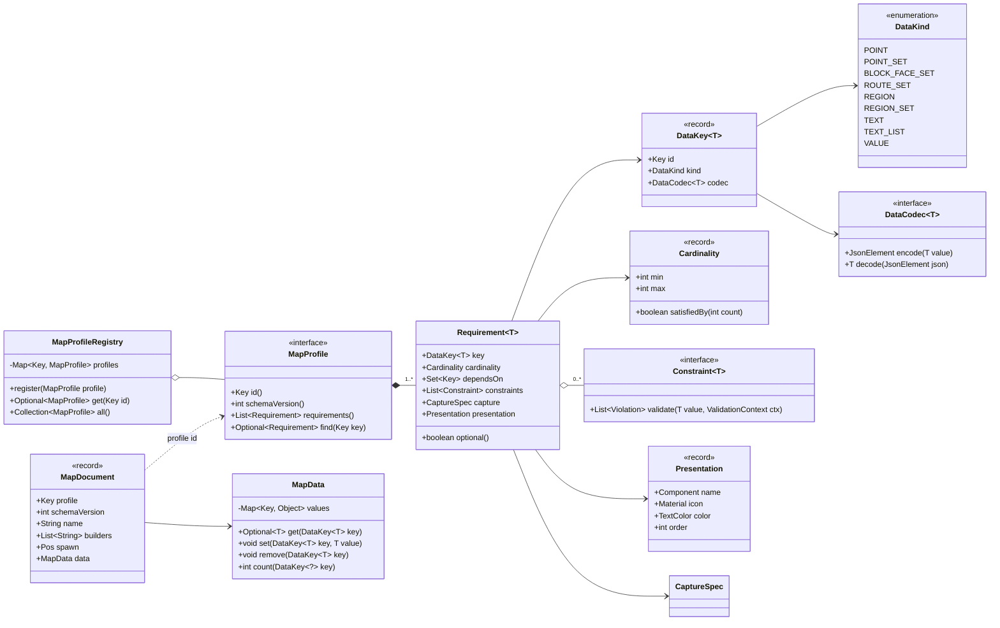
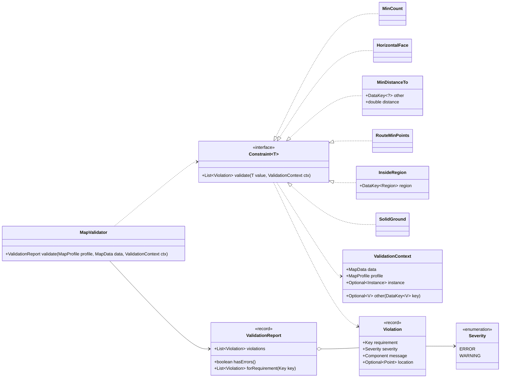
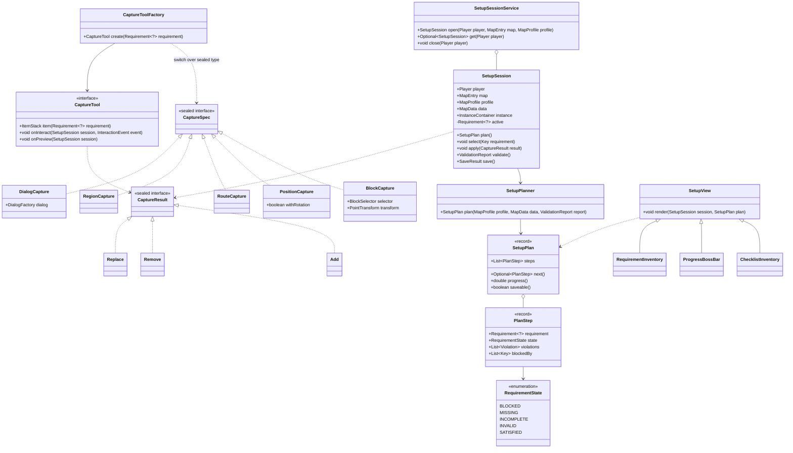
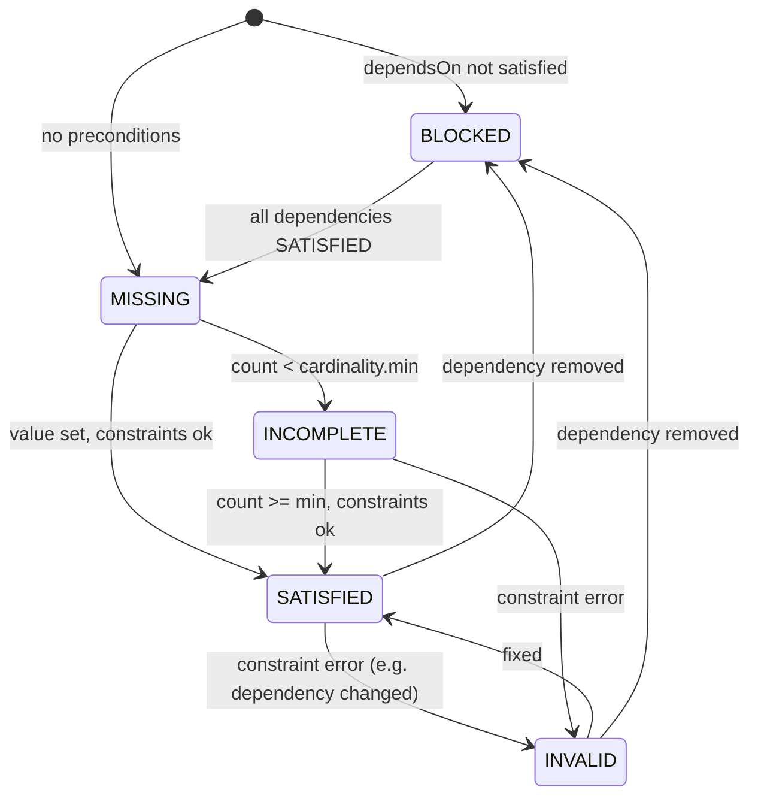
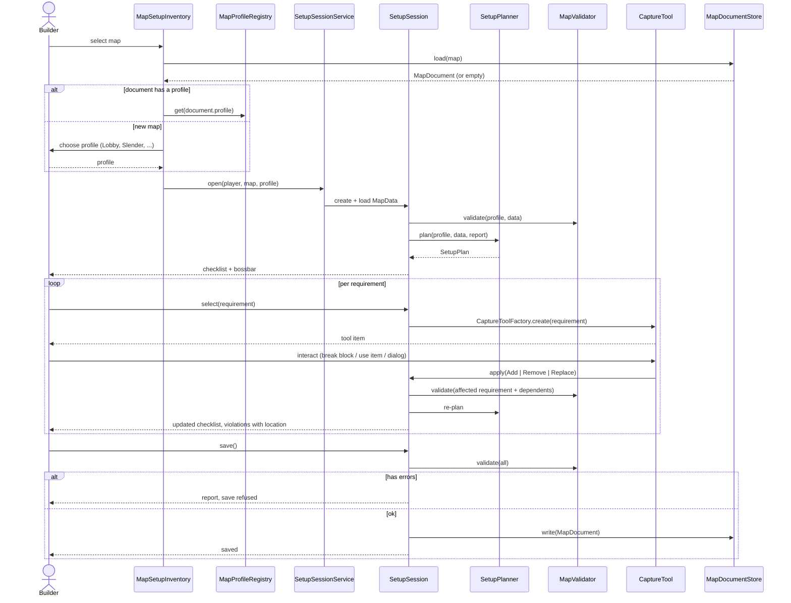
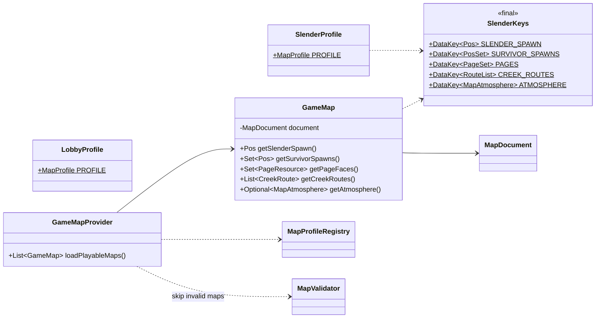

# Setup: Requirement-Driven Map Setup ("Needs")

## Problem

The setup module is written for exactly one game mode (Slender) and one lobby.
Everything a map needs is hardcoded in several places at once:

- `GameMap` has typed fields: `slenderSpawn`, `survivorSpawns`, `pageFaces`,
  `creekRoutes` and `atmosphere`.
- `GameData` is a ~500 line class. It switches on boolean mode flags
  (`pageMode`, `survivorMode`, `creekRouteMode`) and runs an if-chain over
  `SetupItemId` bytes.
- The UI metadata lives in the `MapDataCategory`, `InventoryMode` (with fixed
  slot arrays), `InventoryTarget` and `DialogTarget` enums, plus
  `SetupItems`.
- Placement rules live in the block-break listeners: horizontal page faces,
  spawn at block centre +1Y.
- `SetupMode` only knows LOBBY and GAME.

Adding one new kind of map data, for example a region for a safe zone, means
changing about ten classes. There is also no validation. A map without a
slender spawn or with two pages can be saved. `hasEnoughSurvivorSpawns()`
always returns `true`, and `GameConfig.MIN_PAGE_COUNT` is only checked at
runtime.

## Goal

A game mode **declares what a map needs** (requirements, including
preconditions and constraints). The setup **generates itself** from that
declaration:

- the checklist and the order in which things are set up
- the tools (items), inventories and dialogs
- the validation when saving
- the persistence format

A new game mode or a new map feature then only needs a new requirement
declaration, not changes to the setup module.

## How other games do it

| System | How map data is captured | How requirements are declared | Validation |
|---|---|---|---|
| **Plasmid / Nucleoid** (Fabric) | Map workspace with named **regions** (select two corners) and free NBT data per region/map | Game code reads regions by marker name; which markers are required is documented, not declared | Only at game start (crashes or refuses to open) |
| **Mineplex / Mineplex Studio** | **Data points**: coloured wool / armor stands, parsed into `dataPoints.json` | Per-game list of required data points ("24 GREEN spawns in a circle") | Parser + game start |
| **BedWars1058** | Setup commands / setup items per arena: waiting spawn, team bed, generators; auto-detect for generators | Fixed arena schema per plugin, grouped by arena type | Arena is only enabled when all team entries are set |
| **Source Engine (Hammer)** | Entities such as `info_player_terrorist`, brush entities for zones | **FGD** files declare entity types, their keyvalues and types; the editor UI is generated from the FGD | Hammer "Check for problems" + game refuses a map without spawns |
| **Unreal Engine** | Actors (`PlayerStart`, volumes) placed in the level | `GameMode` classes expect certain actors | **Map Check** runs registered validators and lists errors/warnings |

Patterns that repeat:

1. **Typed, named markers** (point, region, entity) instead of fixed fields.
   The map stores generic data; the game interprets it.
2. **Declarative schema** (FGD, data point list). The editor UI is generated
   from the schema (Hammer), not hand-written per type.
3. **Validation as its own step** with errors vs. warnings (Unreal Map Check,
   BedWars "arena not ready").
4. **Auto-detection as an optional helper** (BedWars generators). It can be a
   capture strategy of its own later.

Cygnus combines 1–3: a declarative requirement schema per game mode
(like an FGD), generic keyed map data (like data points and regions), and a
validator that runs both in the setup and when the game loads the map.

## Concept

### Terms

- **Requirement ("Need")**: one thing a map must or may contain, for example
  "slender spawn", "survivor spawns (min. 4)", "pages (min. 8)", "creek
  routes", "atmosphere". It has a typed `DataKey<T>`, a cardinality, a
  capture strategy, constraints and preconditions.
- **Precondition**: must be fulfilled before a requirement can be edited
  (`dependsOn`). Example: creek routes can only be set up after the survivor
  spawns exist, because a constraint checks the distance to them.
- **Constraint**: rule for the value itself or across requirements, for
  example `MinCount(8)`, `HorizontalFace`, `MinDistance(slenderSpawn, 30)`,
  `RouteMinPoints(2)`.
- **MapProfile**: the set of requirements of one map type. There is one per
  game mode, plus the lobby. It replaces `SetupMode`, `InventoryMode` and
  `MapDataCategory`.
- **MapData**: a generic, keyed store of the captured values.
- **SetupPlan**: generated from profile + current data. It is the ordered
  checklist with the state of every requirement.

### Core model (`common`)



`Requirement.dependsOn` is the precondition graph. `MapProfileRegistry`
checks that it has no cycles when a profile is registered.

### Constraints and validation (`common`)

The same validator runs in the setup (live and on save) and in the game (when
loading a map). A map that fails the game-side validation is skipped instead
of crashing the round.



- `Cardinality` is checked by `MapValidator` itself. Missing required data is
  always an `ERROR`.
- Constraints that need the world (`SolidGround`, `HorizontalFace`) use
  `ctx.instance`. In the game they are skipped when no instance is loaded
  yet, or run after loading.
- Cross-requirement constraints (`MinDistanceTo`, `InsideRegion`) read other
  values through `ctx.other(key)`. The referenced key must be in
  `dependsOn`. The registry checks this, so the precondition graph and the
  constraint references can't drift apart.

### Setup runtime (`setup`)

`SetupSession` replaces `GameData`/`LobbyData`/`InstanceSetupData`. It knows
no game mode; everything comes from the profile.



- `CaptureSpec` lives in `common` as plain data, because the profile
  references it. `CaptureTool` with Minestom interaction lives in `setup`.
  `CaptureToolFactory` maps the one to the other, so the game server never
  loads setup code.
- `BlockCapture` takes a `PointTransform`. This moves the rules that are
  hardcoded in the listeners today into the profile, for example "block
  centre +1Y, pitch 0" for survivor spawns, or "horizontal face from player
  direction" for pages.
- There is one generic interaction listener instead of `PageCreationListener`,
  `SpawnCreationListener`, `CreekRouteListener` and the `SetupItemId` byte
  switch. It forwards the event to the `CaptureTool` of the active
  requirement.
- Views render only `SetupPlan`: the checklist inventory shows one icon per
  requirement (from `Presentation`) coloured by `RequirementState`. The
  bossbar shows `progress()`. Slots are computed from `Presentation.order`,
  not from fixed arrays.
- Existing special previews (`CreekRoutePreview`, `AtmospherePreviewService`)
  become `CaptureTool.onPreview` implementations of the matching tools.

### Requirement states



A map is saveable when no step is `BLOCKED`, `MISSING`, `INCOMPLETE` or
`INVALID`, except for optional requirements. Saving with warnings is allowed.
Saving a draft with errors could be offered as "save as draft" (see open
questions).

### Flow: open, set up, save



### Persistence

One document per map, keyed by requirement id. The profile id and schema
version make it self-describing:

```json
{
  "profile": "cygnus:slender",
  "schemaVersion": 1,
  "name": "Forest",
  "builders": ["Builder1"],
  "spawn": { "x": 0.5, "y": 64, "z": 0.5 },
  "data": {
    "cygnus:slender_spawn": { "x": 10.5, "y": 64, "z": 3.5, "yaw": 90 },
    "cygnus:survivor_spawns": [ { "x": 1.5, "y": 64, "z": 1.5, "yaw": 0 } ],
    "cygnus:pages": [ { "position": { "x": 4, "y": 65, "z": 8 }, "face": "NORTH" } ],
    "cygnus:creek_routes": [ { "name": "north", "points": [ ] } ],
    "cygnus:atmosphere": { "fogColor": "#101418" }
  }
}
```

- `MapDocumentStore` reads and writes the document. For each entry in `data`
  it uses the `DataCodec` of the `DataKey` from the profile. Unknown keys are
  kept as raw `JsonElement` and written back unchanged, so a map built with a
  newer profile doesn't lose data in an older setup.
- `pages.json` and `creek.json` go away. They only exist today because the
  setup rewrote `map.json` and lost data that `GameMap` did not model. A
  generic `data` map removes that reason.
- **Migration**: `LegacyMapMigrator` detects a `map.json` without `profile`,
  reads it with the existing `GameMapAdapter` / `PageFacesFile` /
  `CreekRoutesFile` and writes the new document with `cygnus:slender` (or
  `cygnus:lobby` for the `lobby` folder). A `MapMigration` per
  `schemaVersion` step handles future profile changes.

### Game side (`game`)

The game reads typed values by `DataKey`, not fields. `GameMap` becomes a
thin, typed view over `MapDocument`, so the call sites (`TeamHelper`,
`SlenderReviveListener`, `Cygnus`) barely change:



`GameMapProvider` only loads maps whose `profile` matches the running game
mode and that pass `MapValidator` without errors. It logs the report for
the others. As a side effect this is the basis for choosing between several
maps (rotation/voting) instead of `findAny()`.

### Example: Slender profile

The whole Slender-specific setup knowledge is then this one declaration in
`common`:

```java
public final class SlenderProfile {

    public static final MapProfile PROFILE = MapProfile.builder(Key.key("cygnus", "slender"), 1)
            .require(Requirement.of(SlenderKeys.SLENDER_SPAWN)
                    .exactly(1)
                    .capture(new PositionCapture(true))
                    .constraint(new SolidGround())
                    .presentation("Slender spawn", Material.WITHER_SKELETON_SKULL, NamedTextColor.DARK_RED))
            .require(Requirement.of(SlenderKeys.SURVIVOR_SPAWNS)
                    .atLeast(4)
                    .dependsOn(SlenderKeys.SLENDER_SPAWN)
                    .capture(new BlockCapture(BlockSelector.any(), PointTransform.blockCentreAbove().zeroPitch()))
                    .constraint(new MinDistanceTo(SlenderKeys.SLENDER_SPAWN, 30, Severity.WARNING))
                    .presentation("Survivor spawns", Material.PLAYER_HEAD, NamedTextColor.GREEN))
            .require(Requirement.of(SlenderKeys.PAGES)
                    .atLeast(GameConfig.MIN_PAGE_COUNT)
                    .capture(new BlockCapture(BlockSelector.any(), PointTransform.faceFromPlayer()))
                    .constraint(new HorizontalFace())
                    .presentation("Pages", Material.PAPER, NamedTextColor.WHITE))
            .require(Requirement.of(SlenderKeys.CREEK_ROUTES)
                    .optional()
                    .dependsOn(SlenderKeys.SURVIVOR_SPAWNS)
                    .capture(new RouteCapture())
                    .constraint(new RouteMinPoints(CreekRoute.MIN_POINTS))
                    .presentation("Creek routes", Material.PALE_OAK_LOG, NamedTextColor.GRAY))
            .require(Requirement.of(SlenderKeys.ATMOSPHERE)
                    .optional()
                    .capture(new DialogCapture(AtmosphereDialogs::open))
                    .presentation("Fog", Material.GRAY_STAINED_GLASS, NamedTextColor.DARK_GRAY))
            .build();
}
```

Name, builders and the general spawn are part of `MapDocument` and apply to
every profile, so they don't need to be declared per profile.

## Mapping: today → new

| Today | New |
|---|---|
| `SetupMode` (LOBBY/GAME), left/right click | `MapProfile` chosen from `MapProfileRegistry` (stored in the document after the first save) |
| `MapDataCategory`, `InventoryMode` slot arrays, `InventoryTarget`, `DialogTarget` | `Requirement.presentation` + `SetupPlan`, slots computed |
| `GameData` / `LobbyData` / `InstanceSetupData` | `SetupSession` (one class for all profiles) |
| `pageMode` / `survivorMode` / `creekRouteMode` flags | `SetupSession.active` requirement |
| `SetupItemId` bytes, `SetupItems`, `handleItemInteraction` if-chain | `CaptureToolFactory` + `CaptureTool` per `CaptureSpec` |
| `PageCreationListener`, `SpawnCreationListener`, `CreekRouteListener` | One interaction listener + `BlockCapture` / `RouteCapture` with `PointTransform` |
| `GameMap` fields, `GameMapBuilder`, `GameMapAdapter` | `MapDocument` + `MapData` + `DataKey`/`DataCodec`; `GameMap` as typed view |
| `pages.json`, `creek.json` | Entries in `map.json` → `data` |
| `hasEnoughSurvivorSpawns()` returning `true`, `MIN_PAGE_COUNT` only at runtime | `Cardinality` + `Constraint`, checked by `MapValidator` in setup and game |
| Magic folder name `lobby` | Profile `cygnus:lobby` in the document; the folder name is only a fallback for migration |

## Migration plan

Each step is releasable on its own:

1. **Model + validator in `common`**: `DataKey`, `MapData`, `Requirement`,
   `MapProfile`, `Constraint`, `MapValidator`, `SlenderProfile`,
   `LobbyProfile`. Unit tests for the validator and the precondition graph.
   No behaviour change yet.
2. **Persistence**: `MapDocumentStore` + `LegacyMapMigrator`. `GameMap`
   becomes a view over `MapDocument`. The game reads the new format and still
   accepts the old one.
3. **Game-side validation** in `GameMapProvider`. Invalid maps are skipped
   and logged.
4. **Setup runtime**: `SetupSession`, `SetupPlanner`, checklist view, generic
   interaction listener, capture tools. Move the existing tools over one by
   one (spawn → survivor spawns → pages → creek routes → atmosphere), then
   remove `GameData`, the mode flags, `SetupItemId` and the old enums.
5. **Optional**: `RegionCapture` / `REGION` data (first new use case, for
   example a safe zone or spectator area), auto-detection as a capture
   strategy, "save as draft".

## Rejected alternatives

- **Just extend `GameMap` with more fields**: the cheapest change, but every
  new game mode or feature again touches ~10 classes, and there is still no
  validation.
- **Pure data points like Mineplex (placing coloured wool/armor stands in the
  world, parsing afterwards)**: decouples building from setup, but there is
  no live feedback, no constraints while placing, and the markers must be
  removed from the world after parsing.
- **Fully data-driven profiles from JSON/YAML files**: very flexible, but
  constraints and capture transforms would need their own expression
  language. Profiles in Java keep type safety through `DataKey<T>`. A file
  format can be added later on top of the same model if needed.

## Open questions

- Should "save as draft" with errors be allowed? The game ignores such maps
  anyway because it validates them.
- Should the `setup/maps` and `game/maps` folders stay separate, or should the
  game load validated maps directly from a shared folder?
- Do guira `SetupDataService` / `SetupData` and aves `BaseMap` fit the new
  model, or should `SetupSession` and `MapDocument` replace them in Cygnus
  (or move into the libraries later)?
